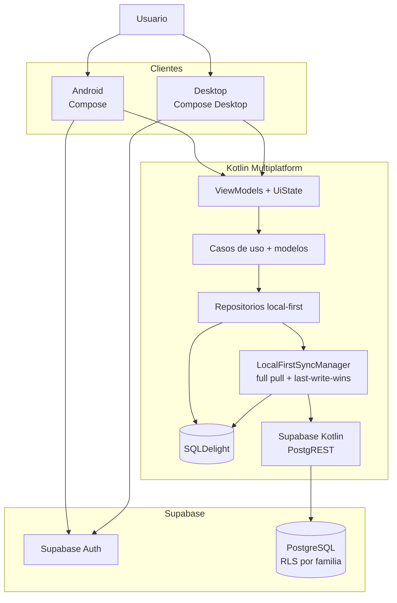
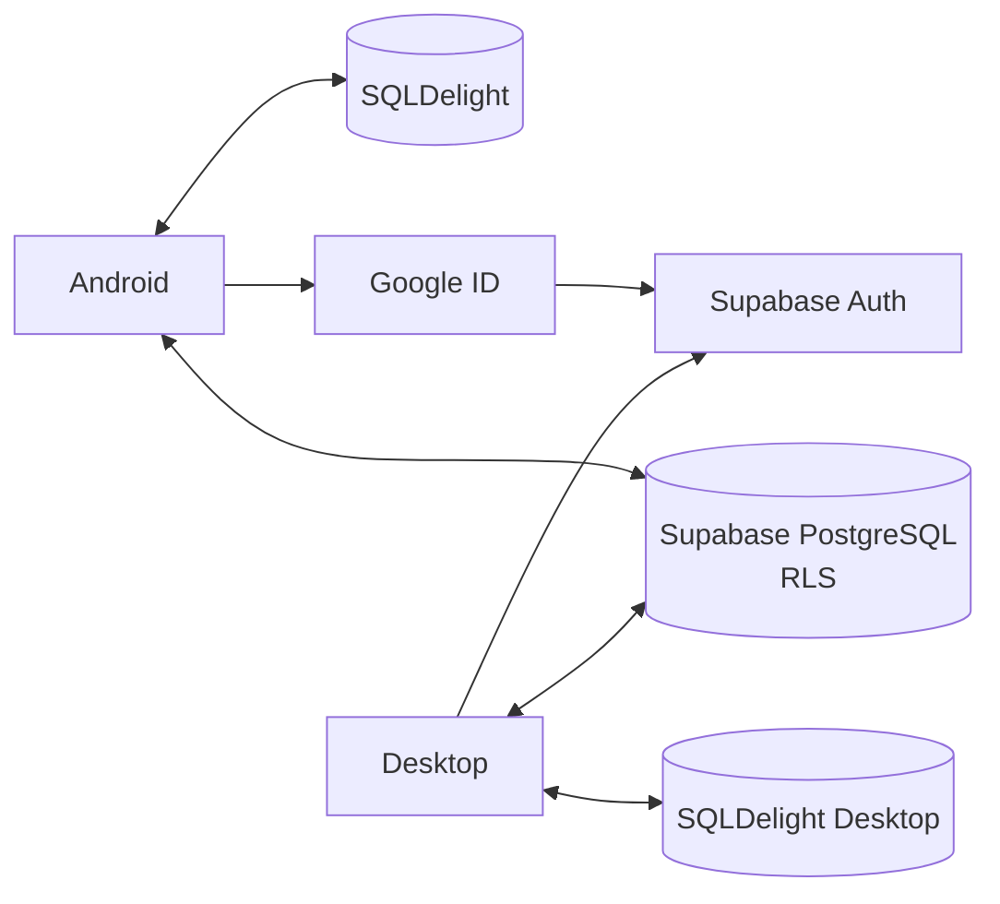
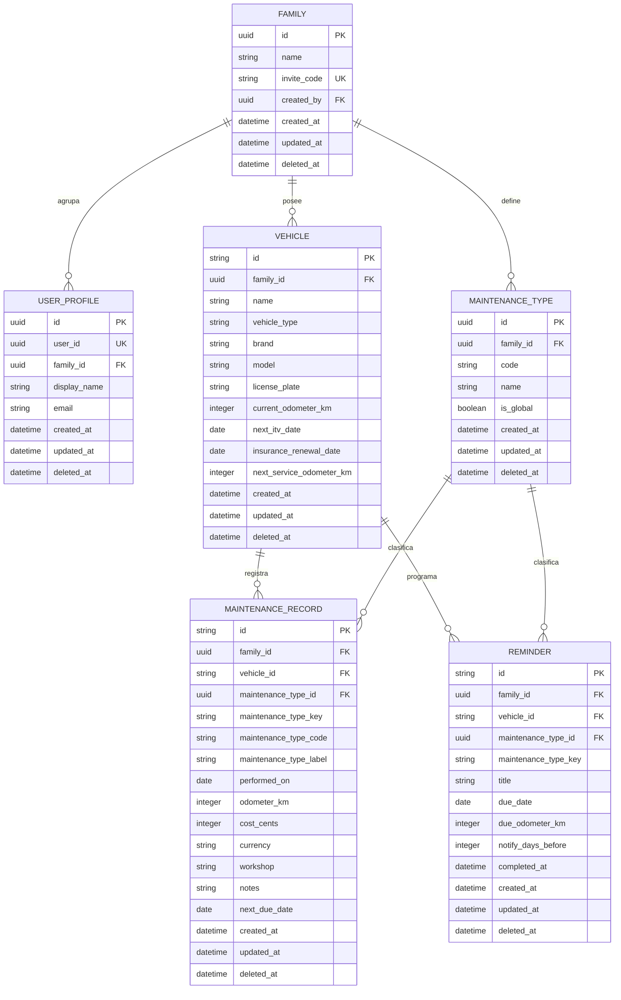

# Carbura

**Tu garaje, siempre a punto.**

La preparación de pruebas manuales, vídeo e instalables está descrita en la [`guía de entrega final`](docs/guia-entrega-final.md).

## Índice

0. [Ficha del proyecto](#0-ficha-del-proyecto)
1. [Descripción general del producto](#1-descripción-general-del-producto)
2. [Arquitectura del sistema](#2-arquitectura-del-sistema)
3. [Modelo de datos](#3-modelo-de-datos)
4. [Especificación de la API](#4-especificación-de-la-api)
5. [Historias de usuario](#5-historias-de-usuario)
6. [Tickets de trabajo](#6-tickets-de-trabajo)
7. [Pull requests](#7-pull-requests)

---

## 0. Ficha del proyecto

### **0.1. Tu nombre completo:**

Ángel Asensio Cuevasanta

### **0.2. Nombre del proyecto:**

Carbura

### **0.3. Descripción breve del proyecto:**

Carbura ofrece clientes funcionales Android y Desktop sobre una arquitectura Kotlin Multiplatform para gestionar vehículos, mantenimientos y recordatorios de una cuenta personal. Ambos trabajan local-first con SQLDelight y sincronizan datos mediante Supabase. Android añade Google ID con Credential Manager y notificaciones locales; Desktop usa OAuth PKCE en navegador, almacenamiento seguro nativo y no programa alertas del sistema. La entrega validada incluye Android y macOS; MSI y ejecución Windows quedan fuera del alcance comprobado porque no se dispone de un PC Windows. iOS y Linux quedan fuera de la entrega.

### **0.4. URL del proyecto:**

https://github.com/asensiodev/Carbura

### **0.5. URL o archivo comprimido del repositorio:**

https://github.com/asensiodev/Carbura

---

## 1. Descripción general del producto

### **1.1. Objetivo:**

El objetivo de Carbura es centralizar el mantenimiento de los vehículos de una cuenta personal en una aplicación sencilla y utilizable sin conexión. Resuelve problemas cotidianos como recordar la próxima ITV, la renovación del seguro o una revisión por kilometraje, consultar cuándo se realizó un mantenimiento y conservar su coste, taller y notas.

El valor principal consiste en reducir olvidos y pérdida de información mediante un historial ordenado por vehículo, recordatorios configurables y sugerencias proactivas. El usuario objetivo no es una flota profesional, sino una persona que necesita control sin complejidad operativa.

### **1.2. Características y funcionalidades principales:**

Funcionalidades disponibles en Android y Desktop:

- Autenticación Android con Google ID mediante Credential Manager y autenticación Desktop mediante navegador, Authorization Code y PKCE S256.
- Creación o recuperación del perfil y de un espacio personal técnico con la RPC `ensure_user_profile`; esta versión no incluye invitaciones ni gestión de miembros.
- Alta, consulta, edición y borrado lógico de vehículos.
- Actualización rápida del odómetro, con confirmación cuando disminuye.
- Registro, consulta, edición y borrado lógico de mantenimientos, incluidos coste opcional, taller, notas y próxima fecha.
- Creación manual, finalización y borrado de recordatorios por fecha, kilometraje o ambos.
- Sugerencias proactivas de recordatorios al crear o editar un vehículo con próxima ITV, renovación del seguro o próxima revisión por kilometraje. El usuario confirma su creación y la reconciliación utiliza identificadores estables para evitar duplicados.
- Creación opcional de un recordatorio al guardar un mantenimiento futuro, sin duplicados y con la posibilidad de guardar solo el mantenimiento.
- Notificaciones locales Android para recordatorios con fecha. Desktop conserva y sincroniza recordatorios, pero no programa alertas nativas.
- Persistencia local con SQLDelight, tombstones y sincronización v0 bidireccional entre Android y Desktop.
- Modo Desktop local sin Supabase e importación explícita, exclusión o cancelación de datos `local-family` antes del primer sync autenticado.
- Sesiones Desktop almacenadas solo en macOS Keychain o Windows Credential Manager.
- Cierre de sesión local y eliminación permanente de cuenta con limpieza convergente en Android y Desktop.

Trabajo pendiente o evolución dentro del alcance descrito por las historias:

- Calcular y presentar el coste acumulado por vehículo.
- Regenerar y validar los artefactos finales, grabar el vídeo y publicar las evidencias de release.
- Incorporar invitaciones familiares y exportación PDF/CSV en evoluciones posteriores.
- Mantener iOS fuera del alcance actual.

La priorización se documenta en [`openspec/prd.md`](openspec/prd.md) y [`docs/user-stories.md`](docs/user-stories.md).

### **1.3. Diseño y experiencia de usuario:**

La experiencia se organiza alrededor de estas áreas:

- **Garaje:** listado de vehículos, alta, edición, borrado y actualización rápida del odómetro.
- **Detalle de vehículo:** acceso al historial y registro de mantenimientos.
- **Recordatorios:** creación manual, consulta de próximos avisos, finalización y borrado.
- **Cuenta:** modo local, autenticación, importación, estado de sincronización, cierre de sesión y eliminación permanente.

El flujo principal disponible es:

```text
Modo local o inicio de sesión
  -> Crear o recuperar perfil y espacio personal
  -> Añadir o editar vehículo
  -> Confirmar recordatorios proactivos del vehículo, si procede
  -> Registrar mantenimiento
  -> Consultar historial
  -> Crear o consultar recordatorios
  -> Sincronizar entre Android y Desktop
```

Android usa Compose para Android y Desktop usa Compose Desktop con áreas de Garaje, Mantenimiento, Recordatorios y Cuenta. En Android, los recordatorios con fecha pueden convertirse en alarmas y notificaciones locales; Desktop solo los persiste y sincroniza para que la aplicación móvil entregue esos avisos.

### **1.4. Instrucciones de instalación:**

Requisitos:

- JDK 17. Para paquetes Desktop nativos se necesita además un JDK completo que incluya `jpackage`.
- Android Studio y un SDK Android compatible.
- macOS para generar y validar DMG. Generar y validar MSI y Credential Manager requiere Windows y queda fuera del alcance comprobado de esta entrega por no disponer de ese host.
- Proyecto Supabase con Google habilitado y las ocho migraciones de `supabase/migrations/` aplicadas en orden.

Crear `local.properties` a partir de [`local.properties.example`](local.properties.example) y completar:

```properties
SUPABASE_URL=https://xxxx.supabase.co
SUPABASE_ANON_KEY=<ANON_OR_PUBLISHABLE_KEY>
GOOGLE_CLIENT_ID=<WEB_CLIENT_ID>.apps.googleusercontent.com
```

`SUPABASE_URL` y `SUPABASE_ANON_KEY` son configuración pública incorporada a los clientes; la autorización depende de RLS. Nunca deben incluirse `service_role`, contraseña de base de datos, Google Client Secret, tokens o sesiones. Desktop usa esas dos propiedades y mantiene el modo local si están vacías. Android necesita además `GOOGLE_CLIENT_ID`, correspondiente al cliente OAuth de tipo Web application. El cliente Android se registra para `com.asensiodev.carbura` con las huellas SHA-1 y, cuando proceda, SHA-256 obtenidas con `./gradlew :app:android:signingReport`.

Google Cloud debe autorizar el callback de Supabase `https://<PROJECT_REF>.supabase.co/auth/v1/callback`. Supabase debe permitir exactamente el callback Desktop `http://127.0.0.1:43821/auth/callback`. Google vuelve a Supabase y Supabase vuelve al listener loopback de Desktop; no se debe registrar el loopback en Google ni sustituir `127.0.0.1` por `localhost`, `0.0.0.0` o comodines.

Comandos principales:

```bash
./gradlew :app:android:assembleDebug
./gradlew :app:android:installDebug
./gradlew :app:desktop:run
./gradlew :app:desktop:packageDmg   # macOS con jpackage
./gradlew :app:desktop:packageMsi   # Configurado, no validado: requiere Windows con jpackage
```

Instalación de los artefactos publicados:

1. Descargar `Carbura-Android-1.0.0-debug.apk`, `Carbura-1.0.0.dmg` y `SHA256SUMS.txt` desde la release `v1.0-final-AAC`.
2. Comprobar su integridad desde el directorio de descarga con `shasum -a 256 -c SHA256SUMS.txt`.
3. En Android, instalar la APK con `adb install -r Carbura-Android-1.0.0-debug.apk` o abrirla desde el dispositivo y autorizar temporalmente ese origen. Es una APK debug para evaluación académica, no una distribución de producción.
4. En macOS, abrir `Carbura-1.0.0.dmg`, arrastrar Carbura a Aplicaciones y ejecutarla desde allí. El DMG usa firma ad-hoc y no está notarizado; si Gatekeeper bloquea el primer arranque, usar clic secundario sobre Carbura, **Abrir** y confirmar la excepción, sin desactivar globalmente la seguridad del sistema.

Si un instalable no es compatible con el equipo de evaluación, se puede ejecutar la misma revisión desde el repositorio:

```bash
./gradlew :app:android:installDebug  # Dispositivo o emulador Android conectado
./gradlew :app:desktop:run           # Desktop desde código fuente
```

La ejecución autenticada desde código requiere las propiedades públicas indicadas arriba. Con `SUPABASE_URL` y `SUPABASE_ANON_KEY` vacías, Desktop conserva el modo local sin sincronización. Los instalables ya incorporan la configuración pública usada para construir la candidata; nunca incluyen credenciales privilegiadas.

Verificación local equivalente a CI:

```bash
./gradlew qualityCheck test assembleDebug :app:desktop:jar --stacktrace
openspec validate prepare-final-delivery --strict
git diff --check
```

La APK debug se genera desde `app:android`. Configurar DMG o MSI no equivale a validar el artefacto instalado: cada paquete debe instalarse y probarse en su sistema objetivo. `local.properties` y cualquier secreto deben permanecer fuera de Git.

---

## 2. Arquitectura del Sistema

### **2.1. Diagrama de arquitectura:**



La arquitectura sigue Clean Architecture, modularización Gradle y una estrategia local-first. La UI observa SQLDelight y las mutaciones se guardan primero en local. Cuando existe una sesión válida, `LocalFirstSyncManager` hace converger los cambios con Supabase.

Las dependencias nativas se aíslan mediante contratos. Android integra Credential Manager, Google ID, ciclo de vida y notificaciones locales. Desktop integra navegador externo, callback loopback estricto, Keychain/Credential Manager y empaquetado nativo. No existe target iOS y Desktop no implementa notificaciones nativas.

Beneficios principales:

- Dominio, modelos, repositorios y parte de la presentación reutilizables.
- Uso de la aplicación y mutaciones sin conexión.
- Aislamiento entre familias mediante sesión y Row Level Security.
- Tests unitarios sobre dominio, repositorios y sincronización.
- Dos clientes funcionales con una base compartida y límites nativos explícitos.

Sacrificios o riesgos:

- La sincronización local-first añade complejidad y lecturas remotas completas.
- `last-write-wins` puede ocultar cambios concurrentes.
- No hay sincronización de datos con la aplicación cerrada, Realtime ni `Service`; Android usa `WorkManager` únicamente para recuperar el outbox de notificaciones.
- La instalación, firma y validación de paquetes debe repetirse por sistema operativo.

### **2.2. Descripción de componentes principales:**

| Componente | Tecnología | Responsabilidad |
|---|---|---|
| Android App | Compose para Android | UI móvil, Credential Manager, ciclo de vida y notificaciones locales. |
| Desktop App | Compose Desktop | UI macOS/Windows, OAuth PKCE, modo local, sync y almacenamiento seguro nativo. |
| ViewModels + UiState | Kotlin Multiplatform | Estado de pantalla, eventos y coordinación con casos de uso. |
| Use Cases | Kotlin común | Reglas de negocio para vehículos, mantenimientos, recordatorios y sesión. |
| Domain Models | Kotlin común | Entidades e identificadores independientes de infraestructura. |
| Repositories | Kotlin común | Coordinación de persistencia local y cambios pendientes. |
| LocalDataSource | SQLDelight | Fuente inmediata de la UI y persistencia local-first. |
| RemoteDataSource | Supabase Kotlin/PostgREST | Lectura y upsert de datos remotos protegidos por RLS. |
| SyncManager | Kotlin común | Full pull, push de pendientes, tombstones y `last-write-wins`. |
| Supabase | Auth y PostgreSQL | Sesión, RPC de perfil/familia, datos remotos y RLS. |

### **2.3. Descripción de alto nivel del proyecto y estructura de ficheros**

```text
Carbura/
├── .github/workflows/ci.yml   # Pipeline real de verificación
├── build-logic/               # Convention plugins Gradle
├── app/
│   ├── android/               # Cliente funcional Android
│   ├── desktop/               # Cliente funcional Desktop macOS/Windows
│   └── shared/                # Rutas y contratos compartidos
├── core/
│   ├── model/                 # Modelos e identificadores
│   ├── domain/                # Casos de uso y contratos
│   ├── data/                  # SQLDelight, repositorios, DTO y sync
│   ├── auth/                  # Supabase Auth y adaptadores
│   ├── designsystem/          # Tema y componentes Android
│   ├── string-resources/      # Claves y resolución de textos
│   └── testing/               # Utilidades de test
├── feature/                   # Onboarding, garaje, mantenimiento y recordatorios
├── quality/architecture/      # Reglas de dependencias modulares
├── supabase/migrations/       # Ocho migraciones SQL vigentes
├── docs/                      # Documentación técnica y funcional
├── openspec/
│   ├── specs/                 # Especificaciones vigentes
│   └── changes/
│       └── archive/           # Cambios OpenSpec cerrados
└── readme.md                  # Plantilla académica principal
```

### **2.4. Infraestructura y despliegue**



No existe servidor propio. Supabase proporciona Auth, PostgreSQL, PostgREST y RLS. Android genera APK y Desktop configura DMG/MSI. La validación instalada de cada paquete es dependiente del sistema operativo.

**CI/CD y evidencia de despliegue (ticket T-11):**

- `.github/workflows/ci.yml` se ejecuta en `push` y `pull_request` sobre Ubuntu con JDK 17.
- El job real ejecuta `./gradlew qualityCheck test assembleDebug --stacktrace`.
- `qualityCheck` agrega ktlint, detekt y `:quality:architecture:test`.
- Una candidata DMG fue instalada y validada en macOS; el artefacto final debe regenerarse y volver a instalarse después de cerrar la aceptación manual.
- El DMG macOS `Carbura-1.0.0.dmg` se generó con Amazon Corretto 17, incluye el icono nativo de Carbura y superó la verificación de imagen y firma interna; SHA-256: `69fb27f77cfd9337c677d9c0aa619daeafb2fb82618a7e573f9f02d60acb9235`.
- El bundle actual tiene firma ad-hoc válida, pero Gatekeeper puede rechazar su distribución hasta disponer de Developer ID y notarización. Windows/MSI queda fuera del alcance validado de la entrega porque no se dispone de un PC Windows.
- Las credenciales permanecen fuera del repositorio; CI no necesita secretos de producción para las comprobaciones actuales.

### **2.5. Seguridad**

- Inicio de sesión con Google ID y Supabase Auth.
- RPC `ensure_user_profile` ejecutable solo por el rol `authenticated` para crear o recuperar la familia personal.
- RLS habilitado en las tablas públicas y políticas basadas en `can_access_family`.
- `family_id` limita las operaciones remotas al garaje accesible por el JWT.
- Variables sensibles excluidas del repositorio mediante `local.properties` y `.gitignore`.
- Tokens Desktop almacenados únicamente en macOS Keychain o Windows Credential Manager, sin fallback en texto plano.
- Listener OAuth Desktop limitado a `127.0.0.1`, callback exacto y PKCE S256.
- La anon/publishable key no es una credencial privilegiada; RLS constituye la frontera de autorización.
- Eliminación de cuenta mediante RPC autenticada y limpieza local convergente.
- `invite_code` existe como campo opcional, pero todavía no constituye un flujo ni una API de invitación.

### **2.6. Tests**

La estrategia combina SDD con OpenSpec, TDD durante la implementación y DDD ligero:

```text
Spec OpenSpec
  -> criterios de aceptación
  -> tests que fallan
  -> código mínimo
  -> refactor
  -> verificación y archivo del cambio
```

La suite incluye tests comunes, Android/Robolectric y Desktop para dominio, repositorios, sync, OAuth, vaults, composición local, importación, eliminación de cuenta y propagación de recordatorios. El pipeline ejecuta `qualityCheck`, `test` y `assembleDebug`; el gate local añade `:app:desktop:jar`, OpenSpec estricto e inspección de artefactos.

El test app-level `MainActivityE2ETest` lanza la actividad Android real con límites externos deterministas y recorre sesión restaurada, alta de vehículo, mantenimiento ITV futuro, historial y recordatorio renderizado usando navegación, ViewModels, casos de uso, repositorios y SQLDelight de producción.

El gate instrumentado `./gradlew connectedDebugAndroidTest --max-workers=1` completó 54 tests en un Pixel 9a real antes de añadir el E2E y 55 tests en un emulador Pixel 9a con el recorrido app-level incluido.

La aceptación final manual debe comprobar la misma familia en Android/Desktop, propagación bidireccional y tombstones, cambios offline, reinicio, LWW, importación/exclusión local, restauración segura de sesión, RLS hostil con dos cuentas, eliminación de cuenta y recordatorios Desktop programados únicamente por Android. La matriz reproducible está en [`docs/guia-entrega-final.md`](docs/guia-entrega-final.md).

### **2.7. Diseño de dominio y principios de código**

Carbura aplica DDD ligero para conservar un modelo claro sin sobrediseñar el producto:

- Entidades principales: `Family`, `UserProfile`, `Vehicle`, `MaintenanceType`, `MaintenanceRecord` y `Reminder`.
- Casos de uso explícitos para vehículos, mantenimientos, recordatorios, autenticación y sincronización.
- Repositorios como frontera entre dominio, SQLDelight y Supabase.
- Identificadores de texto estables generados por el cliente para las entidades sincronizables.

SOLID y CUPID se aplican como criterios pragmáticos: responsabilidades acotadas, dependencias hacia contratos, comportamiento predecible, Kotlin idiomático y lenguaje de dominio claro. No se añaden capas si no aportan claridad, desacoplamiento o capacidad de prueba.

---

## 3. Modelo de Datos

### **3.1. Diagrama del modelo de datos:**

El esquema remoto vigente resulta de aplicar, en orden, las ocho migraciones de `supabase/migrations/`. Vehículos, mantenimientos y recordatorios usan IDs de texto estables; familias, perfiles y tipos de mantenimiento mantienen UUID.



### **3.2. Descripción de entidades principales:**

| Entidad | Descripción | Campos principales | Restricciones |
|---|---|---|---|
| `Family` | Garaje familiar. | UUID, nombre, `invite_code`, `created_by`, timestamps. | `invite_code` opcional y único; creador autenticado. |
| `UserProfile` | Perfil vinculado a Supabase Auth. | UUID, `user_id`, `family_id`, nombre y correo. | `user_id` único y `family_id` obligatorio. |
| `Vehicle` | Vehículo del garaje. | ID texto, familia, nombre, tipo, marca, modelo, matrícula, odómetro y objetivos de ITV, seguro y revisión. | Nombre y tipo obligatorios; kilómetros no negativos. |
| `MaintenanceType` | Catálogo global o específico de familia. | UUID, familia opcional, código, nombre e `is_global`. | Global sin familia o personalizado con familia. |
| `MaintenanceRecord` | Evento del historial. | ID texto, familia, vehículo, tipo/key/code/label, fecha, odómetro, coste en céntimos, moneda, taller, notas y `next_due_date`. | Vehículo y familia relacionados; tipo remoto opcional desde sync v0. |
| `Reminder` | Aviso por fecha o kilometraje. | ID texto, familia, vehículo, título, tipo/key, vencimientos, antelación y `completed_at`. | Debe tener fecha, kilometraje o ambos. |

Las migraciones vigentes son:

1. `202607010001_initial_schema.sql`: tablas, índices, triggers, funciones auxiliares y RLS.
2. `202607070001_ensure_user_profile_rpc.sql`: grants y RPC de creación o recuperación de perfil/familia.
3. `202607080001_sync_v0_schema.sql`: tipo de mantenimiento opcional, claves de tipo y `next_due_date`.
4. `202607080002_sync_v0_text_entity_ids.sql`: IDs de texto para vehículos, mantenimientos y recordatorios.
5. `202607120001_vehicle_planning_fields.sql`: próxima ITV, renovación del seguro y próxima revisión por kilometraje.
6. `202607190001_delete_user_account.sql`: RPC autenticada `delete_current_user_account()` y semántica familiar de eliminación.
7. `202607200001_maintenance_type_label.sql`: etiqueta estable para tipos personalizados de mantenimiento sincronizados.
8. `202607220001_harden_family_profile_authorization.sql`: endurecimiento de familias/perfiles, columnas mutables y `ensure_user_profile`.

La migración 8 debe estar aplicada antes de habilitar Desktop autenticado. La validación de backend debe incluir intentos hostiles con dos cuentas para confirmar la denegación entre familias.

SQLDelight mantiene `updatedAt`, `pendingSync` y `deletedAt` en las tres familias sincronizables. `deleted_at` representa tombstones y `updated_at` resuelve conflictos mediante `last-write-wins`.

---

## 4. Especificación de la API

Carbura no mantiene un backend REST propio ni un contrato agregado de sincronización. El cliente usa Supabase Auth, una RPC PostgREST y operaciones `select`/`upsert` de Supabase Kotlin. Se documentan tres endpoints representativos, máximo exigido por la plantilla; Supabase genera la especificación OpenAPI completa del esquema desplegado.

### **4.1. Autenticación y perfil familiar**

```yaml
operaciones:
  - nombre: iniciarSesionConGoogleId
    endpoint: POST /auth/v1/token?grant_type=id_token
    entrada:
      provider: google
      id_token: string
    salida: sesión Supabase
  - nombre: asegurarPerfilYFamilia
    endpoint: POST /rest/v1/rpc/ensure_user_profile
    entrada:
      profile_display_name: string
      profile_email: string | null
    salida:
      user_id: uuid
      family_id: uuid
      display_name: string
      email: string | null
seguridad: JWT de usuario y rol authenticated
```

Android intercambia Google ID mediante Credential Manager. Desktop realiza Authorization Code con PKCE S256 en el navegador del sistema y callback loopback exacto; ambos terminan en una sesión Supabase vinculada al mismo perfil y espacio personal técnico.

### **4.2. Sincronización de garaje**

La sincronización no utiliza un cursor incremental ni un endpoint agregado. `LocalFirstSyncManager` serializa ciclos con un `Mutex` y, para `vehicles`, `maintenance_records` y `reminders`, realiza:

1. Resolución de sesión, perfil y familia activa.
2. Adopción de filas locales heredadas de `local-family`.
3. Descarga completa por `family_id` de cada familia de entidades.
4. Comparación con filas locales `pendingSync`; solo se suben por upsert las que no tienen una versión remota más reciente.
5. Marcado local de las filas subidas como sincronizadas.
6. Nueva descarga completa y fusión local mediante `last-write-wins` por `updated_at`.

Los borrados convergen como tombstones mediante `deleted_at`. El ciclo se activa al iniciar la sesión, al volver la app a primer plano con limitación temporal, mediante temporizador mientras la composición autenticada está activa, después de mutaciones y por acción manual. No se ejecuta con la aplicación cerrada.

### **4.3. Invitación a garaje familiar**

La invitación familiar no dispone de endpoint, RPC, caso de uso ni interfaz. El campo opcional `families.invite_code` forma parte del esquema inicial, pero no representa por sí mismo un contrato funcional. Su diseño se mantiene fuera del entregable Android actual y deberá especificar membresía, caducidad, permisos y aceptación antes de implementarse.

### **4.4. Especificación OpenAPI de los endpoints Supabase**

La siguiente especificación académica limita la muestra a tres endpoints reales. Las operaciones equivalentes sobre `maintenance_records` y `reminders` se realizan con el SDK de Supabase siguiendo el esquema y las políticas RLS desplegadas, sin introducir un contrato ficticio de sincronización.

```yaml
openapi: 3.0.3
info:
  title: Carbura - API remota Supabase
  version: 1.0.0
servers:
  - url: https://{project_ref}.supabase.co
paths:
  /auth/v1/token:
    post:
      summary: Intercambiar Google ID token por una sesión Supabase
      parameters:
        - name: grant_type
          in: query
          required: true
          schema: { type: string, enum: [id_token] }
      requestBody:
        required: true
        content:
          application/json:
            schema:
              type: object
              required: [provider, id_token]
              properties:
                provider: { type: string, enum: [google] }
                id_token: { type: string }
      responses:
        "200": { description: Sesión creada }
        "400": { description: Token inválido o caducado }
  /rest/v1/rpc/ensure_user_profile:
    post:
      summary: Crear o recuperar el perfil y la familia personal
      security: [{ bearerAuth: [] }]
      requestBody:
        required: true
        content:
          application/json:
            schema:
              type: object
              required: [profile_display_name]
              properties:
                profile_display_name: { type: string }
                profile_email: { type: string, nullable: true }
      responses:
        "200": { description: Perfil y familia resueltos }
        "401": { description: Sesión ausente o inválida }
  /rest/v1/vehicles:
    get:
      summary: Descargar los vehículos accesibles de una familia
      security: [{ bearerAuth: [] }]
      parameters:
        - name: family_id
          in: query
          required: true
          description: Filtro PostgREST con formato eq.UUID
          schema: { type: string }
        - name: select
          in: query
          schema: { type: string, default: "*" }
      responses:
        "200":
          description: Conjunto remoto completo filtrado por familia
          content:
            application/json:
              schema:
                type: array
                items: { $ref: "#/components/schemas/Vehicle" }
    post:
      summary: Subir vehículos pendientes mediante upsert
      security: [{ bearerAuth: [] }]
      requestBody:
        required: true
        content:
          application/json:
            schema:
              type: array
              items: { $ref: "#/components/schemas/Vehicle" }
      responses:
        "201": { description: Filas creadas o actualizadas }
        "403": { description: RLS rechaza el acceso a la familia }
components:
  securitySchemes:
    bearerAuth:
      type: http
      scheme: bearer
      bearerFormat: JWT
  schemas:
    Vehicle:
      type: object
      required: [id, family_id, name, vehicle_type, current_odometer_km]
      properties:
        id: { type: string }
        family_id: { type: string, format: uuid }
        name: { type: string }
        vehicle_type: { type: string }
        brand: { type: string, nullable: true }
        model: { type: string, nullable: true }
        license_plate: { type: string, nullable: true }
        current_odometer_km: { type: integer, minimum: 0 }
        next_itv_date: { type: string, format: date, nullable: true }
        insurance_renewal_date: { type: string, format: date, nullable: true }
        next_service_odometer_km: { type: integer, minimum: 0, nullable: true }
        created_at: { type: string, format: date-time }
        updated_at: { type: string, format: date-time }
        deleted_at: { type: string, format: date-time, nullable: true }
```

Las especificaciones vigentes de backend y sesión están en [`openspec/specs/supabase-backend/spec.md`](openspec/specs/supabase-backend/spec.md) y [`openspec/specs/auth-session/spec.md`](openspec/specs/auth-session/spec.md). La especificación archivada del endurecimiento de sync v0 está en [`openspec/changes/archive/2026-07-09-harden-sync-offline/specs/sync-v0/spec.md`](openspec/changes/archive/2026-07-09-harden-sync-offline/specs/sync-v0/spec.md); el resto de cambios históricos sigue el patrón `openspec/changes/archive/<fecha>-<change-id>/`.

---

## 5. Historias de Usuario

Las historias completas y sus criterios de aceptación están en [`docs/user-stories.md`](docs/user-stories.md). Android y Desktop son clientes funcionales; iOS permanece fuera del alcance.

Historias principales de la entrega:

- **US-01 - Iniciar sesión y disponer de un garaje personal:** completada en Android con Google ID y en Desktop con OAuth PKCE, Supabase Auth y `ensure_user_profile`.
- **US-02 - Gestionar vehículos:** completada para alta, consulta, edición, borrado lógico, objetivos de planificación y odómetro rápido.
- **US-04 - Registrar mantenimiento o avería:** completada para alta, listado y borrado, incluidos kilometraje, coste opcional, taller y notas.
- **US-07 - Gestionar recordatorios:** completada para creación manual, listado, finalización y borrado.
- **US-08 - Recibir una notificación local:** completada en Android para recordatorios con fecha.
- **US-10 - Sincronizar entre sesiones o dispositivos:** completada con los límites de sync v0, full pull y ejecución solo dentro del proceso de la app.
- **US-13 - Obtener sugerencias proactivas desde el vehículo:** completada. Crear o editar un vehículo puede sugerir ITV, seguro y revisión por kilometraje; la confirmación reconcilia IDs estables sin duplicados.
- **US-06 - Generar un recordatorio desde un mantenimiento:** completada con decisión explícita de guardar con o sin recordatorio futuro.
- **Cuenta y modo local Desktop:** completados para importación/exclusión previa al sync, sesión segura, cierre local y eliminación permanente.

---

## 6. Tickets de Trabajo

El backlog completo está en [`docs/backlog.md`](docs/backlog.md). Los tickets reflejan tanto el trabajo cerrado como las tareas pendientes de integración y calidad, sin confundir piezas de dominio aisladas con flujos de usuario completos.

### **6.1. Backlog inicial derivado de user stories**

| Ticket | Área | Historia relacionada | Prioridad | Estado / resultado |
|---|---|---|---|---|
| T-01 | Datos | US-01, US-02, US-04, US-06 | Cerrado | SQLDelight, Supabase, RLS y RPC de perfil implementados. |
| T-02 | Auth / onboarding | US-01 | Cerrado | Google ID Android, OAuth PKCE Desktop y Supabase Auth implementados. |
| T-03 | Vehículos | US-02 | Cerrado | Alta, listado y borrado local-first implementados. |
| T-04 | Mantenimiento | US-04, US-05 | Cerrado parcial | Historial y costes individuales disponibles; total pendiente. |
| T-05 | Recordatorios | US-06 | Cerrado | Integración desde mantenimiento con decisión guardar/crear recordatorio. |
| T-06 | Sincronización | US-02, US-04, US-07 | Cerrado | Sync v0 con full pull, pendientes, tombstones y LWW. |
| T-07 | Presentación | US-02 | Cerrado | Formulario Android de vehículo implementado. |
| T-08 | Presentación | US-04, US-05 | Cerrado | Formulario de mantenimiento e historial implementados. |
| T-09 | Recordatorios | US-07 | Cerrado | Lista y gestión manual implementadas. |
| T-10 | Plataforma | US-08 | Cerrado Android | Alarmas y notificaciones locales para fechas. |
| T-11 | CI/CD | Transversal | En cierre | CI y empaquetado configurados; faltan artefactos finales, vídeo y release. |
| T-12 | Calidad | Flujo principal | Cerrado | E2E Android app-level verificado en emulador. |
| T-13 | Vehículos | US-02, US-09 | Cerrado | Edición y actualización rápida del odómetro. |
| T-14 | Recordatorios | US-13 | Cerrado | Sugerencias proactivas desde vehículo implementadas. |
| T-15 | Costes | US-14 | Alta | Coste acumulado pendiente. |
| T-18 | Multiplataforma | Desktop | Cerrado funcional | Desktop local/auth/sync implementado; iOS fuera de alcance. |

### **6.2. Tickets principales detallados para la entrega**

#### **Ticket 1 - Frontend: alta de vehículo en el garaje**

**Tipo:** frontend / presentación Android y Desktop

**Historia relacionada:** US-02 - Gestionar vehículos

**Objetivo:** permitir que el usuario autenticado cree y edite vehículos, actualice el odómetro y confirme sugerencias proactivas.

**Resultado:** implementado en Android y Desktop con validaciones, estados de carga/error, borrado lógico y persistencia local-first. Los campos opcionales `next_itv_date`, `insurance_renewal_date` y `next_service_odometer_km` generan sugerencias confirmables y reconciliadas mediante IDs estables.

**Criterios de aceptación verificados:**

- Los datos válidos crean o actualizan el vehículo y este aparece en el garaje.
- Los campos obligatorios y kilómetros no negativos se validan.
- Un descenso de odómetro exige confirmación.
- Rechazar una sugerencia guarda el vehículo sin crear esos avisos; aceptarla evita duplicados.

#### **Ticket 2 - Backend/datos: registro de mantenimiento e historial**

**Tipo:** datos / dominio / repositorio / presentación Android y Desktop

**Historia relacionada:** US-04 - Registrar mantenimiento o avería

**Objetivo:** registrar mantenimientos local-first y consultar el historial del vehículo.

**Resultado:** implementado para fecha, kilometraje, coste opcional en céntimos, moneda, taller, notas, listado y borrado lógico. Los registros se marcan como pendientes y participan en sync v0.

**Recordatorio asociado:** una próxima fecha abre una decisión explícita para guardar solo el mantenimiento o guardar también un recordatorio determinista. Desktop lo sincroniza y Android programa sus avisos nativos.

**Criterios de aceptación verificados:**

- Un mantenimiento válido queda persistido y visible en el historial.
- El coste individual se conserva y se muestra.
- Sin red, el registro permanece local y pendiente de sincronización.

#### **Ticket 3 - Base de datos: esquema local y remoto del MVP**

**Tipo:** base de datos / infraestructura

**Historias relacionadas:** US-01, US-02, US-04, US-06, US-07 y US-13

**Objetivo:** soportar familias, perfiles, vehículos, catálogo de mantenimiento, historial, recordatorios y sincronización local-first.

**Resultado:** implementado mediante ocho migraciones Supabase, esquemas SQLDelight, índices, constraints, triggers, grants, RPC de perfil/familia, eliminación de cuenta y políticas RLS endurecidas. Las entidades sincronizables utilizan IDs de texto estables y campos `updated_at`/`deleted_at`; el cliente mantiene además `pendingSync`.

**Criterios de aceptación verificados:**

- Vehículos, mantenimientos y recordatorios conservan la relación con su familia y vehículo.
- RLS restringe las operaciones a familias accesibles por el usuario autenticado.
- Los tombstones sincronizan borrados lógicos.
- Los campos de planificación del vehículo soportan recordatorios proactivos ya disponibles.

---

## 7. Pull Requests

Esta sección conserva las tres Pull Requests exigidas por la plantilla y las alinea con las entregas académicas del proyecto.

Para la Entrega 1 se utiliza una rama `dev` como base de comparación porque la documentación inicial ya se había sincronizado con `main`. La Entrega 2 mantiene la PR académica desde `feature-entrega2-AAC` hacia `dev`; la entrega final se integra desde `finalproject-AAC` hacia `dev`.

Pull Requests oficiales:

- **PR 1 - Entrega 1 / Documentación técnica:** [`feature-entrega1-AAC` hacia `dev`](https://github.com/asensiodev/Carbura/pull/1), con PRD, historias, arquitectura, modelo, API y tickets iniciales.
- **PR 2 - Entrega 2 / MVP funcional:** [`feature-entrega2-AAC` hacia `dev`](https://github.com/asensiodev/Carbura/pull/2), con autenticación, datos, UI Android, sync v0, recordatorios y notificaciones locales.
- **PR 3 - Entrega final:** pendiente de crear desde `finalproject-AAC` hacia `dev` después de completar los artefactos y las evidencias descritas en la [`guía de entrega final`](docs/guia-entrega-final.md).
