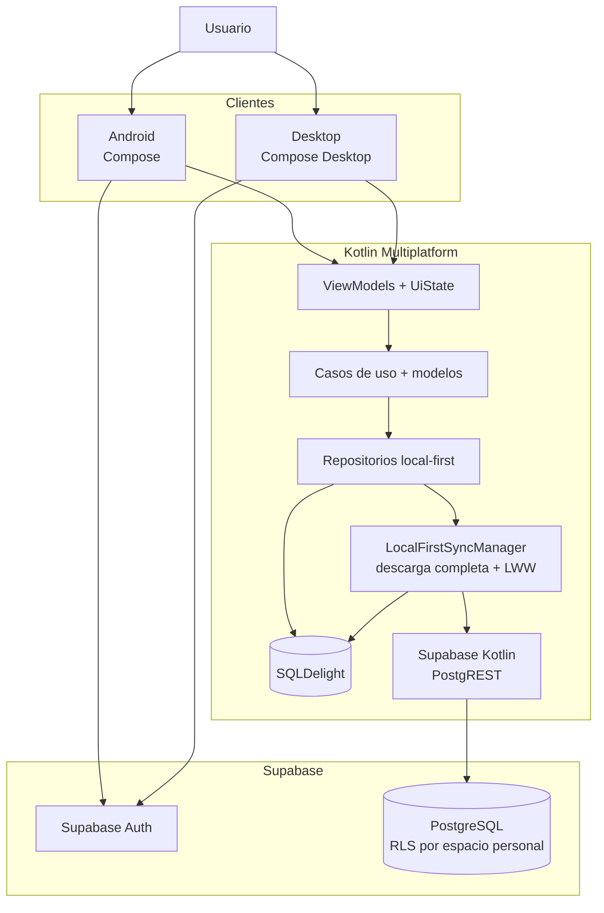
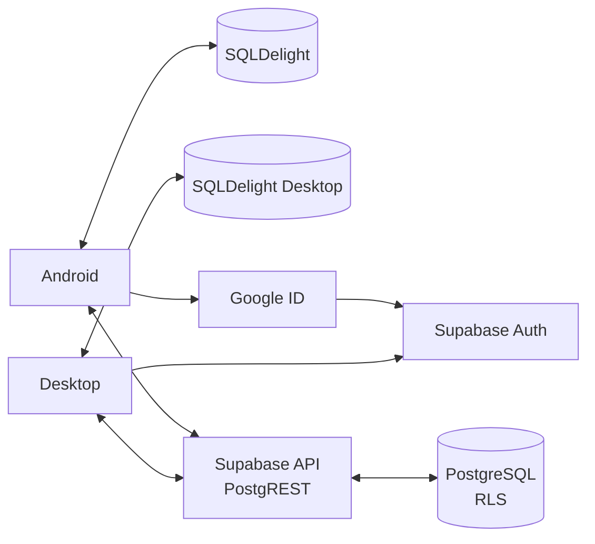

# Carbura

**Tu garaje, siempre a punto.**

Las instrucciones para probar Carbura en Android y macOS están en la sección 1.4.

## Índice

0. [Ficha del proyecto](#0-ficha-del-proyecto)
1. [Descripción general del producto](#1-descripción-general-del-producto)
2. [Arquitectura del sistema](#2-arquitectura-del-sistema)
3. [Modelo de datos](#3-modelo-de-datos)
4. [Especificación de la API](#4-especificación-de-la-api)
5. [Historias de usuario](#5-historias-de-usuario)
6. [Tickets de trabajo](#6-tickets-de-trabajo)
7. [Pull requests](#7-pull-requests)

---

## 0. Ficha del proyecto

### **0.1. Tu nombre completo:**

Ángel Asensio Cuevasanta

### **0.2. Nombre del proyecto:**

Carbura

### **0.3. Descripción breve del proyecto:**

Carbura es una aplicación para gestionar los vehículos, mantenimientos y recordatorios de una cuenta personal, incluso sin conexión.

Sus clientes Android y Desktop comparten lógica mediante Kotlin Multiplatform, conservan los datos localmente con SQLDelight y los sincronizan a través de Supabase cuando existe una sesión autenticada. Android incorpora notificaciones locales; Desktop ofrece además un modo local sin cuenta.

Los artefactos se instalaron y comprobaron en Android y macOS con el alcance descrito en 2.6. El paquete Windows está configurado, pero no se ha validado por falta de un host Windows; iOS y Linux no forman parte de esta versión.

### **0.4. URL del proyecto:**

https://github.com/asensiodev/Carbura

### **0.5. URL o archivo comprimido del repositorio:**

https://github.com/asensiodev/Carbura

---

## 1. Descripción general del producto

### **1.1. Objetivo:**

El objetivo de Carbura es centralizar el mantenimiento de los vehículos de una cuenta personal en una aplicación sencilla y utilizable sin conexión. Resuelve problemas cotidianos como recordar la próxima ITV, la renovación del seguro o una revisión por kilometraje, consultar cuándo se realizó un mantenimiento y conservar su coste, taller y notas.

El valor principal consiste en reducir olvidos y pérdida de información mediante un historial ordenado por vehículo, recordatorios configurables y sugerencias proactivas. El usuario objetivo no es una flota profesional, sino una persona que necesita control sin complejidad operativa.

### **1.2. Características y funcionalidades principales:**

Capacidades principales:

- Alta, consulta, edición y borrado lógico de vehículos.
- Actualización rápida del odómetro, con confirmación cuando disminuye.
- Registro, consulta, edición y borrado lógico de mantenimientos, incluidos coste opcional, taller, notas y próxima fecha.
- Creación manual, finalización y borrado de recordatorios por fecha, kilometraje o ambos.
- Sugerencias proactivas de recordatorios al crear o editar un vehículo con próxima ITV, renovación del seguro o próxima revisión por kilometraje. El usuario confirma su creación y la reconciliación utiliza identificadores estables para evitar duplicados.
- Al guardar un mantenimiento futuro se puede crear, opcionalmente y sin duplicados, un recordatorio asociado; el usuario también puede guardar solo el mantenimiento.
- Persistencia local y sincronización bidireccional entre Android y Desktop.
- Cierre de sesión local en Android y Desktop.
- Solicitud de eliminación permanente de cuenta, con limpieza local convergente aunque una pérdida de conectividad impida confirmar la respuesta remota.

Alcance por plataforma:

| Capacidad | Android | Desktop |
|---|---|---|
| Autenticación | Google ID mediante Credential Manager | OAuth PKCE mediante el navegador del sistema |
| Uso sin conexión | Datos locales después de iniciar sesión | Modo local sin cuenta y datos locales con sesión |
| Sincronización | Supabase al iniciar sesión, durante el uso y bajo acción manual | Supabase durante la sesión; permite importar o excluir los datos del modo local antes del primer ciclo |
| Avisos del sistema | Notificaciones locales para recordatorios con fecha | No programa alertas nativas; conserva y sincroniza los recordatorios |
| Distribución validada | APK debug instalada y comprobada | DMG Apple Silicon instalado y comprobado en macOS; MSI no validado |

En el producto se habla de **espacio personal**. `Family` y `family_id` son los nombres usados en el modelo técnico para aislar los datos de cada cuenta; esta versión no ofrece miembros, invitaciones ni colaboración familiar.

Evolución fuera del alcance del MVP entregado:

- Calcular y presentar el coste acumulado por vehículo.
- Incorporar invitaciones y exportación PDF/CSV.
- Incorporar clientes iOS y Linux y validar el paquete Windows en su sistema objetivo.

La priorización se documenta en [`openspec/prd.md`](openspec/prd.md) y [`docs/user-stories.md`](docs/user-stories.md).

### **1.3. Diseño y experiencia de usuario:**

La experiencia se organiza alrededor de estas áreas:

- **Garaje:** listado de vehículos, alta, edición, borrado y actualización rápida del odómetro.
- **Detalle de vehículo:** acceso al historial y registro de mantenimientos.
- **Recordatorios:** creación manual, consulta de próximos avisos, finalización y borrado.
- **Cuenta:** modo local, autenticación, importación, estado de sincronización, cierre de sesión y solicitud de eliminación permanente.

Carbura ofrece dos recorridos principales:

```text
Desktop sin cuenta
  -> Gestionar vehículos, mantenimientos y recordatorios localmente
  -> Iniciar sesión más adelante, si se desea
  -> Importar o excluir los datos locales antes de sincronizar

Android o Desktop con sesión
  -> Crear o recuperar el perfil y el espacio personal
  -> Añadir o editar vehículo
  -> Confirmar recordatorios proactivos del vehículo, si procede
  -> Registrar mantenimiento
  -> Consultar historial
  -> Crear o consultar recordatorios
  -> Sincronizar entre Android y Desktop
```

Android usa Compose para Android y Desktop usa Compose Desktop con áreas de Garaje, Mantenimiento, Recordatorios y Cuenta. En Android, los recordatorios con fecha pueden convertirse en alarmas y notificaciones locales; Desktop solo los persiste y sincroniza para que la aplicación móvil entregue esos avisos.

### **1.4. Instrucciones de instalación:**

Para probar Carbura se utilizan los instalables de la versión `1.0.0` compartidos junto a `SHA256SUMS.txt`. Su integridad puede comprobarse desde el directorio de descarga con `shasum -a 256 -c SHA256SUMS.txt`.

**Android**

1. Usar un dispositivo o emulador con Android 8.0 o posterior.
2. Instalar `Carbura-Android-1.0.0-debug.apk` abriendo el archivo y autorizando temporalmente ese origen, o ejecutar `adb install -r Carbura-Android-1.0.0-debug.apk`.
3. Abrir Carbura e iniciar sesión con una cuenta Google. La APK usa firma debug y está destinada a pruebas directas, no a distribución mediante una tienda.

**macOS**

1. Usar un Mac con Apple Silicon.
2. Abrir `Carbura-1.0.0.dmg`, arrastrar Carbura a Aplicaciones y ejecutarla desde allí.
3. Si Gatekeeper bloquea el primer arranque, usar clic secundario sobre Carbura, seleccionar **Abrir** y confirmar la excepción. El DMG usa firma ad-hoc y no está notarizado, por lo que no es necesario desactivar globalmente la seguridad del sistema.

Desktop también puede abrirse sin cuenta en modo local. Para iniciar sesión y sincronizar datos entre Android y Desktop se necesita conexión a Internet y una cuenta Google; los instalables ya contienen la configuración pública necesaria y no incluyen credenciales privilegiadas.

---

## 2. Arquitectura del Sistema

### **2.1. Diagrama de arquitectura:**

Este diagrama resume las capas compartidas y el recorrido de los datos; las integraciones específicas de cada sistema operativo se describen después.



La arquitectura sigue Clean Architecture, modularización Gradle y una estrategia local-first. La UI observa SQLDelight y las mutaciones se guardan primero en local. Cuando existe una sesión válida, `LocalFirstSyncManager` hace converger los cambios con Supabase.

Las dependencias nativas se aíslan mediante contratos. Android integra Credential Manager, Google ID, ciclo de vida y notificaciones locales. Desktop integra navegador externo, callback loopback estricto, Keychain/Credential Manager y empaquetado nativo. No existe target iOS y Desktop no implementa notificaciones nativas.

Beneficios principales:

- Dominio, modelos, repositorios y parte de la presentación reutilizables.
- Uso de la aplicación y mutaciones sin conexión.
- Aislamiento entre espacios personales mediante sesión y Row Level Security.
- Pruebas unitarias sobre dominio, repositorios y sincronización.
- Dos clientes funcionales con una base compartida y límites nativos explícitos.

Sacrificios o riesgos:

- La sincronización local-first añade complejidad y requiere descargas remotas completas (`full pull`).
- La estrategia de última escritura prevalece (`last-write-wins`, LWW) puede ocultar cambios concurrentes.
- No hay sincronización de datos con la aplicación cerrada, Realtime ni `Service`; Android usa `WorkManager` únicamente para recuperar la cola pendiente (`outbox`) de notificaciones.
- La instalación, firma y validación de paquetes debe repetirse por sistema operativo.

### **2.2. Descripción de componentes principales:**

| Componente | Tecnología | Responsabilidad |
|---|---|---|
| Android App | Compose para Android | UI móvil, Credential Manager, ciclo de vida y notificaciones locales. |
| Desktop App | Compose Desktop | UI Desktop, OAuth PKCE, modo local, sincronización y almacenamiento seguro nativo; validada como paquete instalado en macOS. |
| ViewModels + UiState | Kotlin Multiplatform | Estado de pantalla, eventos y coordinación con casos de uso. |
| Use Cases | Kotlin común | Reglas de negocio para vehículos, mantenimientos, recordatorios y sesión. |
| Domain Models | Kotlin común | Entidades e identificadores independientes de infraestructura. |
| Repositories | Kotlin común | Coordinación de persistencia local y cambios pendientes. |
| LocalDataSource | SQLDelight | Fuente inmediata de la UI y persistencia local-first. |
| RemoteDataSource | Supabase Kotlin/PostgREST | Lectura y upsert de datos remotos protegidos por RLS. |
| SyncManager | Kotlin común | Descarga completa, subida de pendientes, marcas de borrado (`tombstones`) y LWW. |
| Supabase | Auth y PostgreSQL | Sesión, RPC de perfil y espacio personal, datos remotos y RLS. |

### **2.3. Descripción de alto nivel del proyecto y estructura de ficheros**

```text
Carbura/
├── .github/workflows/ci.yml   # Pipeline de verificación
├── build-logic/               # Convention plugins Gradle
├── app/
│   ├── android/               # Cliente funcional Android
│   ├── desktop/               # Cliente Desktop; macOS validado, Windows configurado
│   └── shared/                # Rutas y contratos compartidos
├── core/
│   ├── model/                 # Modelos e identificadores
│   ├── domain/                # Casos de uso y contratos
│   ├── data/                  # SQLDelight, repositorios, DTO y sync
│   ├── auth/                  # Supabase Auth y adaptadores
│   ├── designsystem/          # Tema y componentes Android
│   ├── string-resources/      # Claves y resolución de textos
│   └── testing/               # Utilidades de test
├── feature/                   # Onboarding, garaje, mantenimiento y recordatorios
├── quality/architecture/      # Reglas de dependencias modulares
├── supabase/migrations/       # Ocho migraciones SQL vigentes
├── docs/                      # Documentación técnica y funcional
├── openspec/
│   ├── specs/                 # Especificaciones vigentes
│   └── changes/
│       └── archive/           # Cambios OpenSpec cerrados
└── readme.md                  # Plantilla académica principal
```

### **2.4. Infraestructura y despliegue**

Este segundo diagrama muestra la topología de ejecución y los servicios externos, no las capas internas representadas en 2.1.



No existe servidor propio. Supabase proporciona Auth, PostgreSQL, PostgREST y RLS. Android genera APK y Desktop configura DMG/MSI. La validación instalada de cada paquete es dependiente del sistema operativo.

**CI/CD y evidencia de despliegue (ticket T-11):**

- `.github/workflows/ci.yml` se ejecuta en `push` y `pull_request` sobre Ubuntu con JDK 17.
- El job de CI ejecuta `./gradlew qualityCheck test assembleDebug --stacktrace`.
- `qualityCheck` agrega ktlint, detekt y `:quality:architecture:test`.
- El DMG final fue generado y verificado en macOS antes de compartir el paquete académico.
- La APK debug final `Carbura-Android-1.0.0-debug.apk` fue instalada y verificada en Android; SHA-256: `afdd3053650854796545ae8e2a5f28178b28f5a1437a5ac7be1b67a29805528f`.
- El DMG macOS `Carbura-1.0.0.dmg` se generó con Amazon Corretto 17, incluye el icono nativo de Carbura y superó la verificación de imagen y firma interna; SHA-256: `69fb27f77cfd9337c677d9c0aa619daeafb2fb82618a7e573f9f02d60acb9235`.
- El bundle actual tiene firma ad-hoc válida, pero Gatekeeper puede rechazar su distribución hasta disponer de Developer ID y notarización. Windows/MSI queda fuera del alcance validado de la entrega porque no se dispone de un PC Windows.
- Las credenciales permanecen fuera del repositorio; CI no necesita secretos de producción para las comprobaciones actuales.

### **2.5. Seguridad**

- Inicio de sesión con Google ID y Supabase Auth.
- RPC `ensure_user_profile` ejecutable solo por el rol `authenticated` para crear o recuperar el perfil y su espacio personal técnico.
- RLS habilitado en las tablas públicas y políticas basadas en `can_access_family`.
- `family_id` limita las operaciones remotas al espacio personal accesible por el JWT.
- Variables sensibles excluidas del repositorio mediante `local.properties` y `.gitignore`.
- Tokens Desktop almacenados únicamente en macOS Keychain o Windows Credential Manager, sin alternativa en texto plano.
- Listener OAuth Desktop limitado a `127.0.0.1`, callback exacto y PKCE S256.
- La anon/publishable key no es una credencial privilegiada; RLS constituye la frontera de autorización.
- Eliminación de cuenta mediante RPC autenticada; la limpieza local se completa aunque el resultado remoto quede sin confirmar por una pérdida de conectividad.
- `invite_code` existe como campo opcional, pero todavía no constituye un flujo ni una API de invitación.

### **2.6. Tests**

La estrategia de desarrollo y validación combina SDD con OpenSpec y TDD durante la implementación. El uso ligero de DDD se describe por separado en 2.7.

```text
Spec OpenSpec
  -> criterios de aceptación
  -> pruebas que fallan
  -> código mínimo
  -> refactor
  -> verificación y archivo del cambio
```

La suite incluye pruebas comunes, Android/Robolectric y Desktop para dominio, repositorios, sincronización, OAuth, almacenamiento seguro, composición local, importación, eliminación de cuenta y propagación de recordatorios. El pipeline ejecuta `qualityCheck`, `test` y `assembleDebug`; la verificación local añade `:app:desktop:jar`, OpenSpec estricto y comprobación del diff.

La evidencia siguiente corresponde a la versión `1.0.0` entregada:

| Evidencia | Entorno | Cobertura y resultado |
|---|---|---|
| Pipeline de CI | Ubuntu y JDK 17 | Calidad estática, reglas de arquitectura, pruebas automatizadas y ensamblado de la APK. |
| Ejecución instrumentada manual registrada el 26/07/2026 | Emulador Pixel 9a | `connectedDebugAndroidTest --max-workers=1`: 55 pruebas superadas. |
| `MainActivityE2ETest` | Aplicación Android con fronteras externas controladas | Prueba de integración de aplicación, E2E dentro del proceso: sesión restaurada, vehículo, mantenimiento ITV futuro, historial y recordatorio renderizado. |
| Aceptación manual | Android y Desktop en macOS | Identidad de cuenta, sincronización bidireccional, marcas de borrado, cambios sin conexión, reinicio, LWW, importación/exclusión local, restauración segura de sesión y programación de avisos únicamente en Android. |

### **2.7. Diseño de dominio y principios de código**

Carbura aplica DDD ligero para conservar un modelo claro sin sobrediseñar el producto:

- Entidades principales: `Family`, `UserProfile`, `Vehicle`, `MaintenanceType`, `MaintenanceRecord` y `Reminder`.
- Casos de uso explícitos para vehículos, mantenimientos, recordatorios, autenticación y sincronización.
- Repositorios como frontera entre dominio, SQLDelight y Supabase.
- Identificadores de texto estables generados por el cliente para las entidades sincronizables.

SOLID y CUPID se aplican como criterios pragmáticos: responsabilidades acotadas, dependencias hacia contratos, comportamiento predecible, Kotlin idiomático y lenguaje de dominio claro. No se añaden capas si no aportan claridad, desacoplamiento o capacidad de prueba.

---

## 3. Modelo de Datos

### **3.1. Diagrama del modelo de datos:**

El esquema remoto vigente resulta de aplicar, en orden, las ocho migraciones de `supabase/migrations/`. Vehículos, mantenimientos y recordatorios usan IDs de texto estables; familias, perfiles y tipos de mantenimiento mantienen UUID.


### **3.2. Descripción de entidades principales:**

| Entidad | Descripción | Campos principales | Restricciones |
|---|---|---|---|
| `Family` | Espacio técnico aislado de una cuenta. | UUID, nombre, `invite_code`, `created_by`, timestamps. | `invite_code` opcional y único; creador autenticado. |
| `UserProfile` | Perfil vinculado a Supabase Auth. | UUID, `user_id`, `family_id`, nombre y correo. | `user_id` único y `family_id` obligatorio. |
| `Vehicle` | Vehículo del garaje. | ID texto, familia, nombre, tipo, marca, modelo, matrícula, odómetro y objetivos de ITV, seguro y revisión. | Nombre y tipo obligatorios; kilómetros no negativos. |
| `MaintenanceType` | Catálogo global o específico de familia. | UUID, familia opcional, código, nombre e `is_global`. | Global sin familia o personalizado con familia. |
| `MaintenanceRecord` | Evento del historial. | ID texto, familia, vehículo, tipo/key/code/label, fecha, odómetro, coste en céntimos, moneda, taller, notas y `next_due_date`. | Vehículo y familia relacionados; tipo remoto opcional desde sync v0. |
| `Reminder` | Aviso por fecha o kilometraje. | ID texto, familia, vehículo, título, tipo/key, vencimientos, antelación y `completed_at`. | Debe tener fecha, kilometraje o ambos. |

Las migraciones vigentes son:

1. `202607010001_initial_schema.sql`: tablas, índices, triggers, funciones auxiliares y RLS.
2. `202607070001_ensure_user_profile_rpc.sql`: permisos y RPC de creación o recuperación de perfil y espacio personal.
3. `202607080001_sync_v0_schema.sql`: tipo de mantenimiento opcional, claves de tipo y `next_due_date`.
4. `202607080002_sync_v0_text_entity_ids.sql`: IDs de texto para vehículos, mantenimientos y recordatorios.
5. `202607120001_vehicle_planning_fields.sql`: próxima ITV, renovación del seguro y próxima revisión por kilometraje.
6. `202607190001_delete_user_account.sql`: RPC autenticada `delete_current_user_account()` y reglas de eliminación del espacio personal.
7. `202607200001_maintenance_type_label.sql`: etiqueta estable para tipos personalizados de mantenimiento sincronizados.
8. `202607220001_harden_family_profile_authorization.sql`: endurecimiento de familias/perfiles, columnas mutables y `ensure_user_profile`.

La migración 8 debe estar aplicada antes de habilitar Desktop autenticado. El repositorio incluye pruebas automatizadas adversariales de políticas y privilegios para comprobar la denegación entre espacios personales.

SQLDelight mantiene `updatedAt`, `pendingSync` y `deletedAt` en los tres tipos de entidad sincronizables. `deleted_at` representa marcas de borrado (`tombstones`) y `updated_at` resuelve conflictos mediante la estrategia LWW.

---

## 4. Especificación de la API

Carbura no mantiene un backend REST propio ni un contrato agregado de sincronización. Los clientes usan Supabase Auth, las RPC PostgREST de perfil y eliminación de cuenta, y operaciones `select`/`upsert` mediante Supabase Kotlin. La muestra siguiente se centra en el acceso Android, la resolución del perfil y la sincronización de vehículos; el flujo OAuth Desktop y la eliminación de cuenta se describen en las especificaciones enlazadas al final de la sección. Supabase genera la especificación OpenAPI completa del esquema desplegado.

### **4.1. Autenticación y perfil familiar**

```yaml
operaciones:
  - nombre: iniciarSesionConGoogleId
    endpoint: POST /auth/v1/token?grant_type=id_token
    entrada:
      provider: google
      id_token: string
    salida: sesión Supabase
  - nombre: asegurarPerfilYEspacioPersonal
    endpoint: POST /rest/v1/rpc/ensure_user_profile
    entrada:
      profile_display_name: string
      profile_email: string | null
    salida:
      user_id: uuid
      family_id: uuid
      display_name: string
      email: string | null
seguridad:
  accesoGoogleId: apikey pública
  perfil: apikey pública, JWT de usuario y rol authenticated
```

Android intercambia Google ID mediante Credential Manager. Desktop realiza Authorization Code con PKCE S256 en el navegador del sistema y callback loopback exacto; ambos terminan en una sesión Supabase vinculada al mismo perfil y espacio personal técnico.

### **4.2. Sincronización de garaje**

La sincronización no utiliza un cursor incremental ni un endpoint agregado. En Desktop, la importación, exclusión o cancelación de `local-family` ocurre como una decisión explícita antes del primer ciclo autenticado; no forma parte de `LocalFirstSyncManager`.

Una vez resuelto ese consentimiento, `LocalFirstSyncManager` serializa los ciclos con un `Mutex` y, para `vehicles`, `maintenance_records` y `reminders`, realiza:

1. Resolución de sesión, perfil y espacio personal activo (`family_id`).
2. Lectura de versiones remotas y comparación con las filas locales `pendingSync`.
3. Subida mediante upsert de las versiones locales que no han sido superadas remotamente.
4. Confirmación local condicionada a que la versión subida siga vigente.
5. Nueva descarga completa y fusión local mediante `last-write-wins` por `updated_at`.

Los borrados convergen como marcas de borrado mediante `deleted_at`. El ciclo se activa al iniciar la sesión, al volver la app a primer plano con limitación temporal, mediante temporizador mientras la composición autenticada está activa, después de mutaciones y por acción manual. No se ejecuta con la aplicación cerrada.

### **4.3. Invitación a garaje familiar**

La colaboración mediante invitaciones no dispone de endpoint, RPC, caso de uso ni interfaz. El campo opcional `families.invite_code` forma parte del esquema inicial, pero no representa por sí mismo un contrato funcional. Su diseño se mantiene fuera de la entrega actual y deberá especificar membresía, caducidad, permisos y aceptación antes de implementarse.

### **4.4. Especificación OpenAPI de los endpoints Supabase**

La siguiente especificación académica limita la muestra a tres rutas reales. Las operaciones equivalentes sobre `maintenance_records` y `reminders` se realizan con el SDK de Supabase siguiendo el esquema y las políticas RLS desplegadas, sin documentar una API agregada que la implementación no expone.

```yaml
openapi: 3.0.3
info:
  title: Carbura - API remota Supabase
  version: 1.0.0
servers:
  - url: https://{project_ref}.supabase.co
    variables:
      project_ref:
        default: example
        description: Referencia del proyecto Supabase
paths:
  /auth/v1/token:
    post:
      summary: Intercambiar Google ID token por una sesión Supabase
      security: [{ apiKey: [] }]
      parameters:
        - name: grant_type
          in: query
          required: true
          schema: { type: string, enum: [id_token] }
      requestBody:
        required: true
        content:
          application/json:
            schema:
              type: object
              required: [provider, id_token]
              properties:
                provider: { type: string, enum: [google] }
                id_token: { type: string }
      responses:
        "200": { description: Sesión creada }
        "400": { description: Token inválido o caducado }
  /rest/v1/rpc/ensure_user_profile:
    post:
      summary: Crear o recuperar el perfil y el espacio personal
      security: [{ apiKey: [], bearerAuth: [] }]
      requestBody:
        required: true
        content:
          application/json:
            schema:
              type: object
              required: [profile_display_name]
              properties:
                profile_display_name: { type: string }
                profile_email: { type: string, nullable: true }
      responses:
        "200": { description: Perfil y espacio personal resueltos }
        "401": { description: Sesión ausente o inválida }
  /rest/v1/vehicles:
    get:
      summary: Descargar los vehículos accesibles del espacio personal
      security: [{ apiKey: [], bearerAuth: [] }]
      parameters:
        - name: family_id
          in: query
          required: true
          description: Filtro PostgREST con formato eq.UUID
          schema: { type: string }
        - name: select
          in: query
          schema: { type: string, default: "*" }
      responses:
        "200":
          description: Conjunto remoto completo filtrado por espacio personal
          content:
            application/json:
              schema:
                type: array
                items: { $ref: "#/components/schemas/Vehicle" }
    post:
      summary: Subir vehículos pendientes mediante upsert
      security: [{ apiKey: [], bearerAuth: [] }]
      parameters:
        - name: Prefer
          in: header
          required: true
          description: El SDK solicita resolución de conflictos mediante merge-duplicates
          schema: { type: string, example: "resolution=merge-duplicates" }
      requestBody:
        required: true
        content:
          application/json:
            schema:
              type: array
              items: { $ref: "#/components/schemas/Vehicle" }
      responses:
        "201": { description: Filas creadas o actualizadas }
        "403": { description: RLS rechaza el acceso al espacio personal }
components:
  securitySchemes:
    apiKey:
      type: apiKey
      in: header
      name: apikey
    bearerAuth:
      type: http
      scheme: bearer
      bearerFormat: JWT
  schemas:
    Vehicle:
      type: object
      required: [id, family_id, name, vehicle_type, current_odometer_km]
      properties:
        id: { type: string }
        family_id: { type: string, format: uuid }
        name: { type: string }
        vehicle_type: { type: string }
        brand: { type: string, nullable: true }
        model: { type: string, nullable: true }
        license_plate: { type: string, nullable: true }
        current_odometer_km: { type: integer, minimum: 0 }
        next_itv_date: { type: string, format: date, nullable: true }
        insurance_renewal_date: { type: string, format: date, nullable: true }
        next_service_odometer_km: { type: integer, minimum: 0, nullable: true }
        created_at: { type: string, format: date-time }
        updated_at: { type: string, format: date-time }
        deleted_at: { type: string, format: date-time, nullable: true }
```

Las especificaciones vigentes de backend y sesión están en [`openspec/specs/supabase-backend/spec.md`](openspec/specs/supabase-backend/spec.md) y [`openspec/specs/auth-session/spec.md`](openspec/specs/auth-session/spec.md). La especificación archivada del endurecimiento de sync v0 está en [`openspec/changes/archive/2026-07-09-harden-sync-offline/specs/sync-v0/spec.md`](openspec/changes/archive/2026-07-09-harden-sync-offline/specs/sync-v0/spec.md); el resto de cambios históricos sigue el patrón `openspec/changes/archive/<fecha>-<change-id>/`.

---

## 5. Historias de Usuario

Las historias completas y sus criterios de aceptación están en [`docs/user-stories.md`](docs/user-stories.md). Android y Desktop son clientes funcionales; iOS permanece fuera del alcance.

Selección de historias principales de la entrega:

- **US-01 - Iniciar sesión y disponer de un garaje personal:** completada en Android con Google ID y en Desktop con OAuth PKCE, Supabase Auth y `ensure_user_profile`.
- **US-02 - Gestionar vehículos:** completada para alta, consulta, edición, borrado lógico, objetivos de planificación y odómetro rápido.
- **US-04 y US-05 - Gestionar el historial de mantenimiento:** US-04 está completada y US-05 queda parcial. La entrega cubre alta, consulta, edición y borrado lógico, incluidos kilometraje, coste opcional, taller y notas; el coste acumulado permanece fuera del MVP.
- **US-06 - Generar recordatorios desde un mantenimiento:** completada. La próxima fecha de ITV o seguro genera un recordatorio determinista; un mantenimiento registrado con fecha futura permite elegir si se crea otro recordatorio.
- **US-07 - Gestionar recordatorios:** parcial. La creación manual, el listado, la finalización y el borrado están disponibles; la antelación visible y el estado visual de vencido quedan como refinamiento.
- **US-08 - Recibir una notificación local:** completada en Android para recordatorios con fecha.
- **US-10 - Sincronizar entre sesiones o dispositivos:** completada con los límites de la sincronización v0, descarga completa y ejecución solo dentro del proceso de la aplicación.
- **US-13 - Obtener sugerencias proactivas desde el vehículo:** completada. Crear o editar un vehículo puede sugerir ITV, seguro y revisión por kilometraje; la confirmación reconcilia IDs estables sin duplicados.
- **US-14 - Usar y proteger la cuenta Desktop:** completada para modo local, importación o exclusión previa a la sincronización, sesión segura, cierre local y solicitud de eliminación permanente.

---

## 6. Tickets de Trabajo

El backlog inicial detallado está en [`docs/backlog.md`](docs/backlog.md). La tabla añade los incrementos posteriores y distingue el trabajo cerrado de las mejoras que permanecen fuera del MVP.

### **6.1. Backlog inicial derivado de user stories**

| Ticket | Área | Historia relacionada | Estado | Plataforma | Resultado |
|---|---|---|---|---|---|
| T-01 | Datos | US-01, US-02, US-04, US-06 | Cerrado | Android y Desktop | SQLDelight, Supabase, RLS y RPC de perfil implementados. |
| T-02 | Auth / onboarding | US-01 | Cerrado | Android y Desktop | Google ID Android, OAuth PKCE Desktop y Supabase Auth implementados. |
| T-03 | Vehículos | US-02 | Cerrado | Android y Desktop | Alta, listado y borrado local-first implementados. |
| T-04 | Mantenimiento | US-04, US-05 | Parcial | Android y Desktop | Historial y costes individuales disponibles; coste acumulado fuera del MVP. |
| T-05 | Recordatorios | US-06 | Cerrado | Android y Desktop | Generación automática desde la próxima fecha de ITV/seguro y oferta opcional para mantenimientos con fecha futura. |
| T-06 | Sincronización | US-02, US-04, US-07 | Cerrado | Android y Desktop | Descarga completa, pendientes, marcas de borrado y LWW. |
| T-07 | Presentación | US-02 | Cerrado | Android | Formulario de vehículo implementado. |
| T-08 | Presentación | US-04, US-05 | Cerrado | Android | Formulario de mantenimiento e historial implementados. |
| T-09 | Recordatorios | US-07 | Parcial | Android y Desktop | Lista y gestión manual implementadas; presentación de antelación y vencidos pendiente. |
| T-10 | Plataforma | US-08 | Cerrado | Android | Alarmas y notificaciones locales para fechas. |
| T-11 | CI / empaquetado | Transversal | Cerrado | Android y macOS | CI configurada y APK/DMG finales generados y verificados; el vídeo se entregó por el canal académico externo. |
| T-12 | Calidad | Flujo principal | Cerrado | Android | Integración de aplicación verificada en emulador. |
| T-13 | Vehículos | US-02, US-09 | Cerrado | Android y Desktop | Edición y actualización rápida del odómetro. |
| T-14 | Recordatorios | US-13 | Cerrado | Android y Desktop | Sugerencias proactivas desde el vehículo implementadas. |
| T-15 | Costes | US-05 | Fuera del MVP | No aplica | Coste acumulado no implementado. |
| T-18 | Multiplataforma | US-14 | Cerrado | Desktop | Modo local, autenticación y sincronización implementados; Windows no validado. |

T-13 en adelante resume incrementos posteriores al backlog inicial. La tabla conserva la numeración histórica del proyecto, que no es consecutiva.

### **6.2. Tickets principales detallados para la entrega**

#### **Ticket 1 - Frontend: alta de vehículo en el garaje**

**Tipo:** frontend / presentación Android y Desktop

**Historia relacionada:** US-02 - Gestionar vehículos

**Objetivo:** permitir que el usuario autenticado cree y edite vehículos, actualice el odómetro y confirme sugerencias proactivas.

**Resultado:** implementado en Android y Desktop con validaciones, estados de carga/error, borrado lógico y persistencia local-first. Los campos opcionales `next_itv_date`, `insurance_renewal_date` y `next_service_odometer_km` generan sugerencias confirmables y reconciliadas mediante IDs estables.

**Criterios de aceptación cubiertos:**

- Los datos válidos crean o actualizan el vehículo y este aparece en el garaje.
- Los campos obligatorios y kilómetros no negativos se validan.
- Un descenso de odómetro exige confirmación.
- Rechazar una sugerencia guarda el vehículo sin crear esos avisos; aceptarla evita duplicados.

#### **Ticket 2 - Backend/datos: registro de mantenimiento e historial**

**Tipo:** datos / dominio / repositorio / presentación Android y Desktop

**Historia relacionada:** US-04 - Registrar mantenimiento o avería

**Objetivo:** registrar y editar mantenimientos local-first y consultar el historial del vehículo.

**Resultado:** implementado para fecha, kilometraje, coste opcional en céntimos, moneda, taller, notas, alta, edición, listado y borrado lógico. Los registros se marcan como pendientes y participan en la sincronización v0.

**Recordatorios asociados:** `next_due_date` en ITV o seguro genera un recordatorio determinista. Si `performed_on` representa un mantenimiento futuro, la interfaz permite guardar solo el registro o crear además un recordatorio opcional. Desktop los sincroniza y Android programa los avisos que tienen fecha.

**Criterios de aceptación cubiertos:**

- Un mantenimiento válido queda persistido y visible en el historial.
- Un mantenimiento activo puede editarse sin perder su relación con el vehículo ni sus recordatorios asociados.
- El coste individual se conserva y se muestra.
- Sin red, el registro permanece local y pendiente de sincronización.

#### **Ticket 3 - Base de datos: esquema local y remoto del MVP**

**Tipo:** base de datos / infraestructura

**Historias relacionadas:** US-01, US-02, US-04, US-06, US-07 y US-13

**Objetivo:** soportar familias, perfiles, vehículos, catálogo de mantenimiento, historial, recordatorios y sincronización local-first.

**Resultado:** implementado mediante ocho migraciones Supabase, esquemas SQLDelight, índices, restricciones, disparadores, permisos, RPC de perfil y espacio personal, eliminación de cuenta y políticas RLS endurecidas. Las entidades sincronizables utilizan IDs de texto estables y campos `updated_at`/`deleted_at`; el cliente mantiene además `pendingSync`.

**Criterios de aceptación cubiertos:**

- Vehículos, mantenimientos y recordatorios conservan la relación con su espacio personal y su vehículo.
- RLS restringe las operaciones al espacio personal accesible por el usuario autenticado.
- Las marcas de borrado sincronizan borrados lógicos.
- Los campos de planificación del vehículo soportan recordatorios proactivos ya disponibles.

---

## 7. Pull Requests

Esta sección proporciona trazabilidad entre las tres entregas académicas y sus Pull Requests.

La Entrega 1 y la Entrega 2 se integraron mediante PR hacia `dev`. La entrega final se presenta para revisión desde `finalproject-AAC` hacia `dev`; la PR permanece abierta como evidencia académica.

Pull Requests oficiales:

- **PR 1 - Entrega 1 / Documentación técnica:** [`feature-entrega1-AAC` hacia `dev`](https://github.com/asensiodev/Carbura/pull/1), con PRD, historias, arquitectura, modelo, API y tickets iniciales.
- **PR 2 - Entrega 2 / MVP funcional:** [`feature-entrega2-AAC` hacia `dev`](https://github.com/asensiodev/Carbura/pull/2), con autenticación, datos, UI Android, sincronización v0, recordatorios y notificaciones locales.
- **PR 3 - Entrega final:** [`finalproject-AAC` hacia `dev`](https://github.com/asensiodev/Carbura/pull/3), con la aplicación Android/Desktop final, pruebas, empaquetado y documentación de entrega. El vídeo y los artefactos se entregan mediante el canal académico externo.
