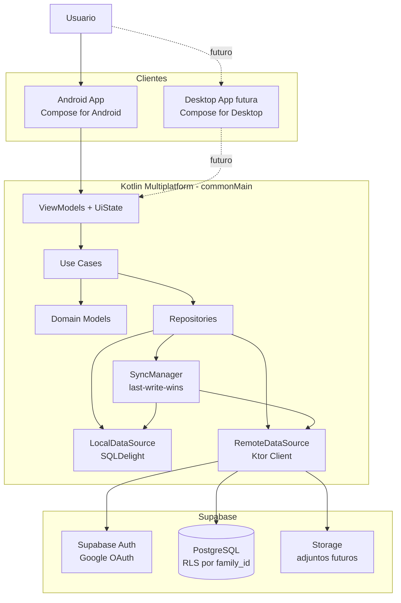
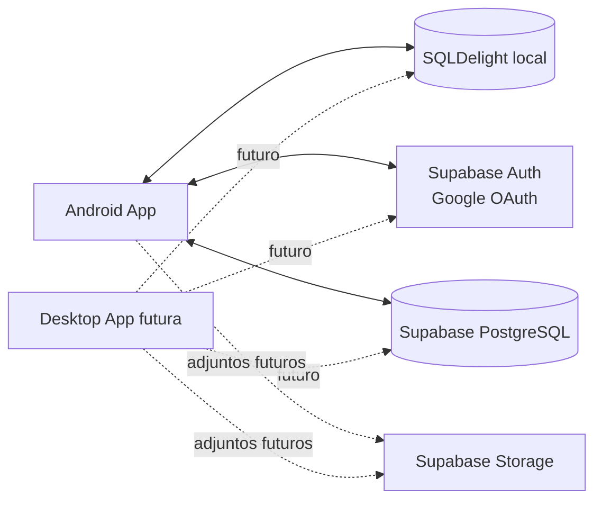
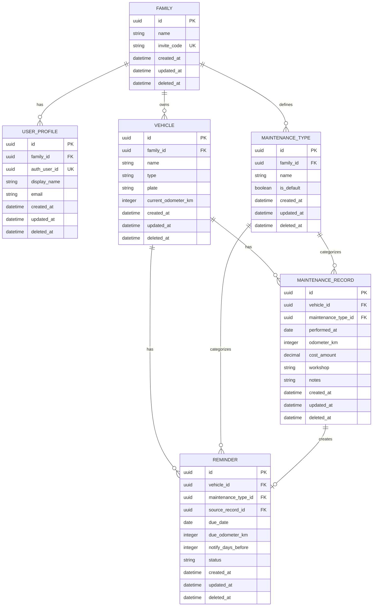

# Carbura

**Tu garaje, siempre a punto.**

## Índice

0. [Ficha del proyecto](#0-ficha-del-proyecto)
1. [Descripción general del producto](#1-descripción-general-del-producto)
2. [Arquitectura del sistema](#2-arquitectura-del-sistema)
3. [Modelo de datos](#3-modelo-de-datos)
4. [Especificación de la API](#4-especificación-de-la-api)
5. [Historias de usuario](#5-historias-de-usuario)
6. [Tickets de trabajo](#6-tickets-de-trabajo)
7. [Pull requests](#7-pull-requests)

---

## 0. Ficha del proyecto

### **0.1. Tu nombre completo:**

Ángel Asensio Cuevasanta

### **0.2. Nombre del proyecto:**

Carbura

### **0.3. Descripción breve del proyecto:**

Carbura es una aplicación Android-first, preparada con arquitectura Kotlin Multiplatform, orientada a familias que necesitan gestionar el mantenimiento de sus vehículos. Permite registrar vehículos, mantenimientos, averías, costes, kilometraje y recordatorios de vencimientos como ITV o seguro, con persistencia local y sincronización eventual mediante Supabase.

### **0.4. URL del proyecto:**

https://github.com/asensiodev/Carbura

### **0.5. URL o archivo comprimido del repositorio:**

https://github.com/asensiodev/Carbura

---

## 1. Descripción general del producto

### **1.1. Objetivo:**

El objetivo de Carbura es centralizar el mantenimiento de los vehículos de una familia en una única aplicación sencilla, accesible y offline-first. El producto resuelve un problema cotidiano: recordar cuándo caduca la ITV, cuándo se hizo el último cambio de aceite, cuánto costó una reparación o qué mantenimiento tiene pendiente cada vehículo.

El valor principal está en reducir olvidos y pérdida de información, creando un historial ordenado por vehículo y generando recordatorios automáticos antes de fechas críticas. El usuario objetivo no es una flota profesional, sino una persona o familia con varios vehículos que necesita control sin complejidad.

### **1.2. Características y funcionalidades principales:**

Funcionalidades del MVP core:

- Gestión de un garaje familiar.
- Alta y consulta de vehículos.
- Registro de mantenimientos, averías, ITV, seguro, aceite, neumáticos y revisiones.
- Historial por vehículo con fecha, kilómetros y coste.
- Recordatorios por fecha y/o kilometraje, creados manualmente o desde mantenimientos con vencimiento.
- Autenticación con Google mediante Supabase Auth.
- En Android, Credential Manager con Google ID es la vía principal de login; existe fallback controlado a Google Sign-In/OAuth si el dispositivo o los servicios disponibles no lo soportan.
- Persistencia local offline-first.
- Sincronización v0 con Supabase para vehículos, mantenimientos y recordatorios usando `last-write-wins`.
- Notificaciones locales Android para recordatorios.

Funcionalidades post-MVP o de Entrega final:

- App Desktop desde la misma base KMP.
- Recordatorios proactivos desde el alta/edición de vehículo.
- Actualización rápida de odómetro.
- Invitación de familiares mediante código.
- Exportación de historial a PDF o CSV.

El detalle de priorización vive en `openspec/prd.md` (sección 5) y `docs/user-stories.md`.

### **1.3. Diseño y experiencia de usuario:**

La experiencia se plantea alrededor de tres pantallas principales:

- **Garaje:** vista inicial con todos los vehículos de la familia, estado resumido y próximos avisos.
- **Detalle de vehículo:** información del vehículo, odómetro, historial y acciones rápidas.
- **Recordatorios:** lista de vencimientos próximos, vencidos o asociados a kilometraje.

El flujo principal del MVP será:

```text
Inicio de sesión
  -> Cargar o crear garaje familiar personal
  -> Añadir vehículo
  -> Registrar mantenimiento
  -> Consultar historial
  -> Crear o ver recordatorio
  -> Sincronizar con Supabase
```

La interfaz de Entrega 2 está implementada en Compose for Android. La arquitectura conserva dominio, datos y estado reutilizables para Desktop/iOS futuro, pero esos targets no forman parte del entregable funcional actual.

### **1.4. Instrucciones de instalación:**

El proyecto ya cuenta con una base Kotlin Multiplatform modular. Android es la plataforma principal para Entrega 2; Desktop queda diferido como objetivo posterior.

Requisitos:

- Android Studio con soporte Kotlin Multiplatform.
- JDK compatible con la versión de Gradle del proyecto.
- Cuenta y proyecto Supabase.
- Google OAuth configurado en Supabase Auth.
- Variables locales en `local.properties`, nunca versionadas. La plantilla segura vive en [`local.properties.example`](local.properties.example) y la guia de setup en [`docs/supabase-setup.md`](docs/supabase-setup.md).

Configuración local:

```properties
SUPABASE_URL=https://xxxx.supabase.co
SUPABASE_ANON_KEY=xxxx
GOOGLE_CLIENT_ID=xxxx.apps.googleusercontent.com
```

Comandos de verificación:

```bash
./gradlew tasks
./gradlew test
./gradlew assembleDebug
```

La APK debug se genera desde el módulo `app:android`. La configuración real de Supabase se lee desde `local.properties` y no debe commitearse.

---

## 2. Arquitectura del Sistema

### **2.1. Diagrama de arquitectura:**



La arquitectura sigue Clean Architecture, modularizacion Gradle y una estrategia offline-first. La aplicación lee y escribe primero en local mediante SQLDelight. La sincronización con Supabase se realiza de forma eventual cuando hay conexión.

Las dependencias nativas se aislan con un patron comun: contrato en KMP y adapter por plataforma. Esto aplica a autenticacion, permisos, notificaciones, storage seguro, deep links y APIs del sistema. Android implementa auth con Credential Manager + Google ID; Desktop, si entra, usara OAuth mediante navegador; iOS futuro tendra su adapter propio sin contaminar dominio ni casos de uso.

Beneficios principales:

- La lógica de negocio vive en `commonMain` y se comparte entre Android, Desktop e iOS futuro.
- Las integraciones nativas se aíslan con contratos comunes y adapters por plataforma.
- El design system vive en un módulo compartido para reutilizar tema, tokens y componentes base.
- La app sigue siendo usable sin conexión.
- Los tests unitarios pueden concentrarse en dominio, casos de uso, repositorios y sincronización.
- Supabase resuelve autenticación, base de datos remota, Row Level Security y almacenamiento.

Sacrificios o riesgos:

- La sincronización offline-first añade complejidad al MVP.
- La estrategia `last-write-wins` es simple, pero puede sobrescribir cambios concurrentes.
- Desktop y Android comparten lógica y parte del design system, pero capacidades como auth, permisos, notificaciones, storage seguro y APIs de sistema requieren adapters específicos por plataforma.

### **2.2. Descripción de componentes principales:**

| Componente | Tecnología | Responsabilidad |
|---|---|---|
| Android App | Compose for Android | UI móvil, permisos Android y notificaciones locales. |
| Desktop App | Compose for Desktop | UI de escritorio futura para macOS y Windows. Diferida en Entrega 2. |
| Platform Adapters | Android/Desktop/iOS futuro | Implementan contratos comunes para auth, permisos, notificaciones, secure storage y APIs nativas. |
| Design System | Compose Multiplatform | Tema, tokens visuales y componentes base reutilizables. |
| ViewModels + UiState | Kotlin Multiplatform | Estado de pantalla, eventos de usuario y exposición de datos a UI. |
| Use Cases | Kotlin común | Reglas de negocio: crear vehículo, registrar mantenimiento, generar recordatorio. |
| Domain Models | Kotlin común | Entidades del dominio independientes de infraestructura. |
| Repositories | Kotlin común | Coordinan fuentes locales, remotas y sincronización. |
| LocalDataSource | SQLDelight | Persistencia local offline-first. |
| RemoteDataSource | Ktor Client + Supabase | Acceso remoto a Auth, PostgreSQL y Storage. |
| SyncManager | Kotlin común | Sincronización eventual, reintentos y resolución `last-write-wins`. |
| Supabase | Auth, PostgreSQL, Storage | Backend gestionado, autenticación Google y RLS por `family_id`. |

### **2.3. Descripción de alto nivel del proyecto y estructura de ficheros**

Estructura objetivo del repositorio:

```text
Carbura/
├── build-logic/                # Convention plugins Gradle del proyecto
├── app/
│   ├── android/                # App Android, navegación, adapters Android
│   └── shared/                 # Rutas y contratos compartidos de app
├── core/
│   ├── model/                  # Modelos compartidos
│   ├── domain/                 # Entidades, use cases y contratos
│   ├── data/                   # Repositorios e implementación coordinadora
│   ├── auth/                   # Adapter Supabase/Auth Android y configuración
│   ├── designsystem/           # Tema, tokens y componentes Compose base
│   ├── string-resources/       # Recursos de texto compartidos/type-safe
│   └── testing/                # Utilidades base de test
├── feature/
│   ├── onboarding/
│   ├── garage/
│   ├── maintenance/
│   └── reminders/
├── docs/                       # Documentación funcional, técnica, herramientas IA y evidencias
│   ├── user-stories.md
│   └── toolchain/
├── openspec/                   # SDD: PRD, contexto, specs y cambios
│   ├── project.md
│   ├── prd.md
│   ├── specs/
│   ├── changes/
│   └── archive/
├── readme.md                   # Documentación principal de entrega
├── local.properties.example    # Ejemplo de configuración local sin secretos
└── .gitignore
```

### **2.4. Infraestructura y despliegue**

Infraestructura prevista para el MVP:



El despliegue del backend se apoya en Supabase. No se prevé servidor propio para el MVP. La Entrega 2 se verifica como build Android; Desktop queda preparado en arquitectura pero no como artefacto funcional de esta entrega.

**CI/CD y evidencia de despliegue (ticket T-11):**

Al ser Carbura una aplicación KMP nativa (Android + Desktop), no existe una URL pública de frontend. La evidencia de despliegue y el pipeline se plantean así:

- **CI con GitHub Actions:** compilación y ejecución de `./gradlew test` en cada push y pull request.
- **Gestión de secretos:** credenciales de Supabase y Google OAuth fuera del repositorio (`local.properties` en local, GitHub Secrets en CI).
- **Release final:** artefactos instalables, como mínimo APK Android, publicados en GitHub Releases con tag `v1.0-final-AAC`. El paquete Desktop se añadirá solo si entra en alcance final.
- **Sistema "en vivo":** el backend Supabase (Auth + PostgreSQL con RLS) es el entorno desplegado y accesible; el flujo principal se documentará además con un vídeo demo de 2-3 minutos y capturas.

### **2.5. Seguridad**

- Autenticación con Google mediante Supabase Auth.
- Aislamiento de datos por `family_id`.
- Row Level Security en Supabase para evitar acceso cruzado entre familias.
- Variables sensibles fuera del repositorio mediante `local.properties` o entorno local.
- `.gitignore` preparado para excluir `.env`, `local.properties`, claves, keystores y credenciales.
- Invitaciones familiares completas quedan fuera de Entrega 2; cada usuario crea/carga una familia personal inicial.

### **2.6. Tests**

La estrategia de calidad combina SDD con OpenSpec, TDD durante la implementación y DDD ligero para el diseño del dominio:

```text
Spec OpenSpec
  -> criterios de aceptación
  -> modelo de dominio mínimo
  -> tests que fallan
  -> código mínimo
  -> refactor
  -> verificación
```

Tests previstos y en evolución:

- Tests unitarios de casos de uso: alta de vehículo, registro de mantenimiento, generación de recordatorio.
- Tests de repositorio con dobles de LocalDataSource y RemoteDataSource.
- Tests de integración de la capa de datos: SQLDelight local y, cuando aplique, acceso a Supabase con datos de prueba.
- Tests de sincronización para cambios offline y resolución `last-write-wins`.
- Tests de validación de formularios y estados vacíos.
- **Test E2E del flujo principal** (ticket T-12): test instrumentado de Compose UI que recorre el flujo completo `sesión -> alta de vehículo -> registro de ITV -> historial -> recordatorio automático visible`, con login de test y base de datos limpia por ejecución.
- Tests instrumentados o manuales para notificaciones locales según plataforma.

La suite (unitarios, integración y E2E) se ejecutará en el pipeline de CI (ticket T-11). El TDD se aplicará durante la implementación de cada spec OpenSpec: primero se escribirán tests que fallen, después el código mínimo para pasarlos y finalmente refactor seguro. El test E2E se escribe al final, cuando el flujo core está implementado, como verificación de extremo a extremo.

### **2.7. Diseño de dominio y principios de código**

Carbura aplicará DDD ligero para mantener un modelo de dominio claro sin sobrediseñar el MVP:

- Entidades principales: `Family`, `UserProfile`, `Vehicle`, `MaintenanceType`, `MaintenanceRecord` y `Reminder`.
- Use cases explícitos para operaciones del dominio: alta de vehículo, registro de mantenimiento, generación de recordatorio y sincronización.
- Repositorios como contratos entre dominio y fuentes de datos locales/remotas.
- Value objects solo cuando aporten claridad o validación real, por ejemplo identificadores, kilometraje o importes.

El código del MVP seguirá SOLID y CUPID como criterios de diseño pragmáticos:

- **SOLID**: responsabilidades acotadas, dependencias hacia contratos, entidades de dominio protegidas y casos de uso fáciles de probar.
- **CUPID**: componentes composables, comportamiento predecible, código idiomático Kotlin, lenguaje de dominio claro y soluciones simples.
- Estos principios se aplicarán especialmente en use cases, repositorios, view models, modelos de dominio y fuentes de datos.
- No se introducirán capas o abstracciones innecesarias si no aportan testabilidad, claridad o desacoplamiento real para el MVP.
- BDD queda fuera del alcance metodológico del MVP para evitar duplicar criterios de aceptación y mantener el proceso simple.

---

## 3. Modelo de Datos

### **3.1. Diagrama del modelo de datos:**



### **3.2. Descripción de entidades principales:**

| Entidad | Descripción | Campos principales | Restricciones |
|---|---|---|---|
| `Family` | Garaje familiar o workspace compartido. | `id`, `name`, `invite_code`, timestamps. | `invite_code` único. |
| `UserProfile` | Perfil interno vinculado al usuario autenticado en Supabase. | `id`, `family_id`, `auth_user_id`, `display_name`, `email`. | `auth_user_id` único, `family_id` obligatorio. |
| `Vehicle` | Vehículo registrado en el garaje. | `id`, `family_id`, `name`, `type`, `plate`, `current_odometer_km`. | Pertenece a una `Family`; `name` y `type` obligatorios. |
| `MaintenanceType` | Catálogo de tipos de mantenimiento. | `id`, `family_id`, `name`, `is_default`. | Puede ser global por familia o personalizado. |
| `MaintenanceRecord` | Evento histórico realizado sobre un vehículo. | `id`, `vehicle_id`, `maintenance_type_id`, `performed_at`, `odometer_km`, `cost_amount`, `workshop`, `notes`. | Requiere vehículo, tipo, fecha y kilómetros. |
| `Reminder` | Aviso futuro por fecha o kilometraje. | `id`, `vehicle_id`, `maintenance_type_id`, `source_record_id`, `due_date`, `due_odometer_km`, `notify_days_before`, `status`. | Debe tener `due_date`, `due_odometer_km` o ambos. |

Campos de sincronización:

- `created_at`: fecha de creación.
- `updated_at`: fecha de última modificación, usada para `last-write-wins`.
- `deleted_at`: borrado lógico para poder sincronizar eliminaciones.

---

## 4. Especificación de la API

El MVP no plantea un backend propio con endpoints REST custom. La comunicación remota se realizará con Supabase Auth (GoTrue) y Supabase PostgreSQL (PostgREST), consumidos desde Ktor Client. Aunque el backend es gestionado, Supabase expone endpoints HTTP reales, por lo que la documentación se presenta en dos niveles:

- **Contratos lógicos** (4.1 a 4.3): operaciones de negocio tal y como las consume la capa `RemoteDataSource`.
- **Especificación OpenAPI** (4.4): los 3 endpoints HTTP principales de Supabase que implementan esos contratos.

### **4.1. Autenticación y perfil familiar**

```yaml
operation: signInWithGoogleAndLoadProfile
provider: Supabase Auth
input:
  google_id_token: string
output:
  session:
    access_token: string
    refresh_token: string
  user_profile:
    id: uuid
    family_id: uuid | null
    display_name: string
    email: string
errors:
  - invalid_google_token
  - profile_not_found
  - network_error
```

### **4.2. Sincronización de garaje**

```yaml
operation: syncGarageData
provider: Supabase PostgreSQL
input:
  family_id: uuid
  last_sync_at: datetime | null
  local_changes:
    vehicles: Vehicle[]
    maintenance_records: MaintenanceRecord[]
    reminders: Reminder[]
output:
  remote_changes:
    vehicles: Vehicle[]
    maintenance_records: MaintenanceRecord[]
    reminders: Reminder[]
  server_timestamp: datetime
conflict_strategy: last-write-wins using updated_at
errors:
  - unauthorized_family_access
  - sync_conflict_unresolvable
  - network_error
```

### **4.3. Invitación a garaje familiar**

```yaml
operation: joinFamilyByInviteCode
provider: Supabase PostgreSQL
input:
  invite_code: string
  auth_user_id: uuid
output:
  family_id: uuid
  membership_status: joined
errors:
  - invalid_invite_code
  - expired_invite_code
  - user_already_in_family
  - network_error
```

### **4.4. Especificación OpenAPI de los endpoints Supabase**

Los 3 endpoints HTTP principales que consume la app, en formato OpenAPI 3.0. Todas las peticiones a PostgREST incluyen la cabecera `apikey` y el token JWT del usuario, de forma que Row Level Security filtra automáticamente por `family_id`.

> **Nota de alcance:** se documentan únicamente estos 3 endpoints como simplificación intencional para la entrega (la plantilla pide un máximo de 3). PostgREST expone el mismo patrón `GET`/`POST` para el resto de tablas del modelo (`maintenance_records` en lectura, `reminders`, `maintenance_types`, `families`, `user_profiles`), que siguen exactamente la misma semántica de seguridad, filtro incremental por `updated_at` y upsert. El ciclo completo de sincronización está descrito en el contrato lógico `syncGarageData` (sección 4.2).
>
> **Documentación completa:** Supabase genera automáticamente la especificación OpenAPI de todas las tablas expuestas en `GET /rest/v1/` (con la cabecera `apikey` del proyecto). El contrato detallado para implementación —tablas, RLS, cabeceras de upsert y filtros de sync— vive en `openspec/specs/supabase-backend/spec.md` y `openspec/specs/sync-v0/spec.md`.

```yaml
openapi: 3.0.3
info:
  title: Carbura - API remota (Supabase)
  description: >
    Endpoints gestionados por Supabase que consume el cliente KMP.
    GoTrue para autenticación y PostgREST para datos con RLS por family_id.
  version: 1.0.0
servers:
  - url: https://{project_ref}.supabase.co
    variables:
      project_ref:
        default: xxxx
paths:
  /auth/v1/token:
    post:
      summary: Iniciar sesión con Google (intercambio de id_token)
      description: >
        Intercambia el id_token de Google Sign-In por una sesión Supabase.
        Implementa el contrato signInWithGoogleAndLoadProfile (4.1).
      parameters:
        - name: grant_type
          in: query
          required: true
          schema:
            type: string
            enum: [id_token]
      requestBody:
        required: true
        content:
          application/json:
            schema:
              type: object
              required: [provider, id_token]
              properties:
                provider:
                  type: string
                  enum: [google]
                id_token:
                  type: string
      responses:
        "200":
          description: Sesión creada.
          content:
            application/json:
              schema:
                type: object
                properties:
                  access_token: { type: string }
                  refresh_token: { type: string }
                  expires_in: { type: integer }
                  user:
                    type: object
                    properties:
                      id: { type: string, format: uuid }
                      email: { type: string }
        "400":
          description: id_token de Google inválido o caducado.
  /rest/v1/vehicles:
    get:
      summary: Listar vehículos del garaje familiar
      description: >
        Lectura de vehículos para sincronización (contrato syncGarageData, 4.2).
        RLS limita el resultado a la family_id del usuario autenticado.
      security:
        - bearerAuth: []
      parameters:
        - name: updated_at
          in: query
          required: false
          description: Filtro incremental de sync, p. ej. gte.2026-06-01T00:00:00Z
          schema:
            type: string
        - name: select
          in: query
          required: false
          schema:
            type: string
            default: "*"
      responses:
        "200":
          description: Vehículos de la familia del usuario.
          content:
            application/json:
              schema:
                type: array
                items:
                  $ref: "#/components/schemas/Vehicle"
        "401":
          description: Token ausente o inválido.
    post:
      summary: Crear o actualizar vehículos (upsert de sync)
      description: >
        Subida de cambios locales pendientes. Con la cabecera
        Prefer: resolution=merge-duplicates actúa como upsert por id.
      security:
        - bearerAuth: []
      requestBody:
        required: true
        content:
          application/json:
            schema:
              type: array
              items:
                $ref: "#/components/schemas/Vehicle"
      responses:
        "201":
          description: Vehículos creados o actualizados.
        "401":
          description: Token ausente o inválido.
        "403":
          description: RLS rechaza escritura fuera de la family_id del usuario.
  /rest/v1/maintenance_records:
    post:
      summary: Registrar mantenimientos (upsert de sync)
      description: >
        Persistencia remota de los registros de mantenimiento creados
        offline-first en el cliente (contrato syncGarageData, 4.2).
      security:
        - bearerAuth: []
      requestBody:
        required: true
        content:
          application/json:
            schema:
              type: array
              items:
                $ref: "#/components/schemas/MaintenanceRecord"
      responses:
        "201":
          description: Registros creados o actualizados.
        "401":
          description: Token ausente o inválido.
        "403":
          description: RLS rechaza escritura fuera de la family_id del usuario.
components:
  securitySchemes:
    bearerAuth:
      type: http
      scheme: bearer
      bearerFormat: JWT
  schemas:
    Vehicle:
      type: object
      required: [id, family_id, name, type, current_odometer_km]
      properties:
        id: { type: string, format: uuid }
        family_id: { type: string, format: uuid }
        name: { type: string }
        type: { type: string }
        plate: { type: string, nullable: true }
        current_odometer_km: { type: integer, minimum: 0 }
        created_at: { type: string, format: date-time }
        updated_at: { type: string, format: date-time }
        deleted_at: { type: string, format: date-time, nullable: true }
    MaintenanceRecord:
      type: object
      required: [id, vehicle_id, maintenance_type_id, performed_at, odometer_km]
      properties:
        id: { type: string, format: uuid }
        vehicle_id: { type: string, format: uuid }
        maintenance_type_id: { type: string, format: uuid }
        performed_at: { type: string, format: date }
        odometer_km: { type: integer, minimum: 0 }
        cost_amount: { type: number, nullable: true }
        workshop: { type: string, nullable: true }
        notes: { type: string, nullable: true }
        created_at: { type: string, format: date-time }
        updated_at: { type: string, format: date-time }
        deleted_at: { type: string, format: date-time, nullable: true }
```

---

## 5. Historias de Usuario

Las historias de usuario completas del MVP están documentadas en [`docs/user-stories.md`](docs/user-stories.md).

Historias principales seleccionadas para la entrega:

- **US-02 - Añadir vehículo al garaje**: representa el core de gestión del dominio.
- **US-04 - Registrar mantenimiento o avería**: demuestra el valor principal del producto.
- **US-06 - Generar recordatorio automático tras registrar ITV o seguro**: conecta historial con prevención.

---

## 6. Tickets de Trabajo

Los tickets de trabajo se derivan de las historias Must-Have y Should-Have del flujo E2E. En Entrega 2 ya se implementó el bloque Android-first principal usando OpenSpec y TDD; T-11/T-12 quedan orientados a entrega final.

El backlog completo y detallado está en [`docs/backlog.md`](docs/backlog.md). El orden recomendado prioriza datos, dominio/backend y después frontend/plataforma para reducir dependencias bloqueantes.

### **6.1. Backlog inicial derivado de user stories**

| Ticket | Área | Historia relacionada | Prioridad | Estimación | Resultado esperado |
|---|---|---|---|---|---|
| T-01 | Datos | US-01, US-02, US-04, US-06 | Must | 8 SP | Esquema local/remoto con familias, vehículos, mantenimientos y recordatorios. |
| T-02 | Auth / onboarding | US-01 | Must | 5 SP | Usuario autenticado con Google y garaje familiar creado. |
| T-03 | Dominio / datos | US-02 | Must | 5 SP | Caso de uso y repositorio para crear vehículo offline-first. |
| T-04 | Dominio / datos | US-04, US-05 | Must | 8 SP | Registro persistido e historial ordenado por vehículo. |
| T-05 | Dominio / recordatorios | US-06 | Must | 5 SP | Creación automática de recordatorio tras ITV o seguro. |
| T-06 | Sincronización | US-02, US-04 | Must | 8 SP | Cambios locales marcados como pendientes y preparados para sync. |
| T-07 | Frontend / presentación | US-02 | Must | 5 SP | Formulario de alta de vehículo con validaciones y estados. |
| T-08 | Frontend / presentación | US-04, US-05 | Must | 8 SP | Formulario de mantenimiento e historial por vehículo. |
| T-09 | Frontend / recordatorios | US-07 | Should | 5 SP | Pantalla de próximos recordatorios con estados vacío/vencido. |
| T-10 | Plataforma / notificaciones | US-08 | Should | 5 SP | Notificación local previa a vencimientos configurados. |
| T-11 | Infraestructura / CI-CD | Transversal | Must (final) | 5 SP | Pipeline CI con tests, gestión de secretos, release con artefactos y evidencia de despliegue. |
| T-12 | Calidad / tests | US-01 a US-06 | Must (final) | 5 SP | Test E2E automatizado del flujo principal completo. |

### **6.2. Tickets principales detallados para la entrega**

#### **Ticket 1 - Frontend: alta de vehículo en el garaje**

**Tipo:** frontend / shared presentation

**Historia relacionada:** US-02 - Añadir vehículo al garaje

**Objetivo:** permitir que un usuario autenticado cree un vehículo desde la interfaz y vea el resultado en la lista del garaje.

**Alcance:**

- Pantalla o diálogo de alta de vehículo.
- Campos mínimos: nombre, tipo, matrícula opcional y kilómetros actuales.
- Validaciones de campos obligatorios.
- Estado de carga, éxito y error.
- Actualización de la lista tras guardar.

**Fuera de alcance:**

- Edición avanzada de vehículo.
- Subida de imágenes.
- Gestión de múltiples garajes.

**Tareas técnicas:**

1. Crear `VehicleFormUiState` con campos, errores y estado de guardado.
2. Crear ViewModel o intent/event para alta de vehículo.
3. Conectar el formulario con el caso de uso `CreateVehicleUseCase`.
4. Mostrar validaciones si falta nombre, tipo o kilómetros válidos.
5. Refrescar la lista del garaje después de guardar.

**Criterios de aceptación:**

- Dado un garaje activo, cuando el usuario introduce datos válidos, entonces el vehículo se guarda.
- Dado un formulario incompleto, cuando el usuario intenta guardar, entonces se muestran errores de validación.
- Dado un vehículo guardado, cuando vuelve al garaje, entonces aparece en la lista.

**Tests TDD previstos:**

- Test de validación de formulario sin nombre.
- Test de validación de kilómetros negativos.
- Test de envío correcto que invoca el caso de uso.
- Test de estado de éxito tras alta completada.

#### **Ticket 2 - Backend/datos: registro de mantenimiento e historial**

**Tipo:** backend/datos / dominio / repositorio

**Historia relacionada:** US-04 - Registrar mantenimiento o avería

**Objetivo:** implementar el flujo de registro de mantenimiento y persistirlo en el historial del vehículo, preparado para offline-first.

**Alcance:**

- Caso de uso `CreateMaintenanceRecordUseCase`.
- Validación de vehículo, tipo, fecha y kilometraje.
- Persistencia local mediante repositorio.
- Marcado del registro como pendiente de sincronización.
- Consulta de historial ordenado por fecha descendente.

**Fuera de alcance:**

- Adjuntos de facturas.
- OCR.
- Recomendaciones automáticas.

**Tareas técnicas:**

1. Definir modelo de dominio `MaintenanceRecord`.
2. Crear validaciones del caso de uso.
3. Añadir métodos de repositorio para crear y listar registros.
4. Persistir `created_at`, `updated_at` y estado pendiente de sync.
5. Exponer consulta de historial por vehículo.

**Criterios de aceptación:**

- Dado un vehículo existente, cuando se registra un mantenimiento válido, entonces queda guardado.
- Dado un mantenimiento con coste, cuando se consulta el historial, entonces el coste aparece asociado.
- Dado que el usuario está offline, cuando registra el mantenimiento, entonces queda local y pendiente de sincronización.

**Tests TDD previstos:**

- Test de creación válida de mantenimiento.
- Test de error si falta tipo de mantenimiento.
- Test de error si los kilómetros son inválidos.
- Test de historial ordenado por fecha descendente.
- Test de registro creado con estado pendiente de sincronización.

#### **Ticket 3 - Base de datos: esquema local y remoto del MVP**

**Tipo:** base de datos / infraestructura

**Historias relacionadas:** US-02, US-04, US-06

**Objetivo:** crear el esquema inicial de datos para soportar familias, usuarios, vehículos, tipos de mantenimiento, registros y recordatorios.

**Alcance:**

- Tablas locales SQLDelight.
- Tablas remotas Supabase PostgreSQL.
- Claves primarias y foráneas.
- Campos de sincronización.
- Índices mínimos.
- RLS por `family_id` en Supabase.

**Fuera de alcance:**

- Migraciones históricas complejas.
- Multi-familia por usuario.
- Auditoría avanzada.

**Tareas técnicas:**

1. Crear tablas `families`, `user_profiles`, `vehicles`, `maintenance_types`, `maintenance_records` y `reminders`.
2. Añadir `created_at`, `updated_at` y `deleted_at` a las entidades sincronizables.
3. Crear índices por `family_id`, `vehicle_id` y `updated_at`.
4. Definir constraints de integridad para relaciones principales.
5. Configurar políticas RLS para que cada usuario solo acceda a su familia.

**Criterios de aceptación:**

- Dado el esquema creado, cuando se inserta un vehículo, entonces queda asociado a una familia.
- Dado un mantenimiento, cuando se inserta, entonces debe pertenecer a un vehículo existente.
- Dado un usuario autenticado, cuando consulta datos, entonces solo accede a su `family_id`.
- Dado un cambio local, cuando se sincroniza, entonces `updated_at` permite resolver conflictos simples.

**Tests TDD previstos:**

- Test de inserción y lectura de vehículo local.
- Test de relación vehículo-mantenimiento.
- Test de consulta de recordatorios por vehículo.
- Test SQL/RLS manual en Supabase para aislamiento por familia.

---

## 7. Pull Requests

Esta sección se completará con exactamente 3 Pull Requests, alineadas con las entregas oficiales del proyecto.

Para la Entrega 1 se crea una rama `dev` como base de comparación porque la documentación inicial ya fue sincronizada previamente en `main`. Para la Entrega 2 se mantiene la PR académica desde `feature-entrega2-AAC` hacia `dev` para mostrar el diff de la entrega, y además se sincroniza `main` con los cambios aprobados para mantener la rama principal actualizada.

PRs previstas:

- **PR 1 - Entrega 1 / Documentación técnica:** PR desde `feature-entrega1-AAC` hacia `dev` con PRD, user stories, arquitectura, modelo de datos, API y tickets iniciales.
- **PR 2 - Entrega 2 / MVP funcional:** PR desde `feature-entrega2-AAC` hacia `dev` con backend, frontend, base de datos, sync v0, notificaciones locales y flujo principal Android-first.
- **PR 3 - Entrega final:** PR desde `finalproject-AAC` hacia `main` con flujo E2E completo, tests, despliegue/evidencia y documentación cerrada.
